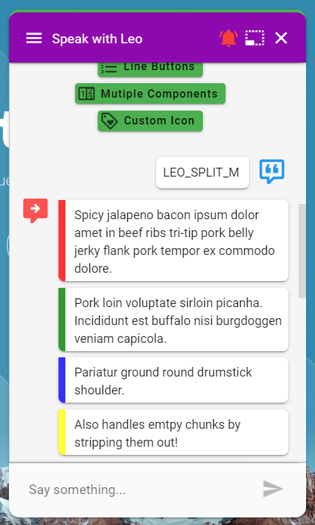

# Answer Borders

If the **output parameter** "`border`" exists then it's value will be used as the left border or the response or [response chunks](splitting-a-response.md). 

```javascript
border = #FF4C5B
```

If you want to control the borders for each [response chunk](splitting-a-response.md) the you will need a "`borders`" **output parameter** and an array of colors. 

```javascript
borders = ["Red", "#00FF00", "", "Blue"]
```


borders will always take precedence if both output parameters are present on a response.


## Screenshots











