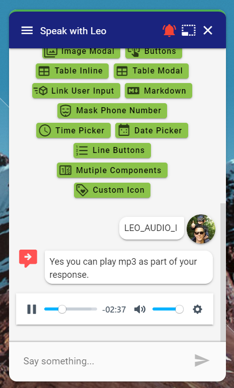

# Audio Player

## Introduction

The audio player is the same component as the [video player](video.md). The component looks at the file extension and presents either a video or audio player. 

## Modal

### Screenshot


### Output Parameter

```groovy
extensions = ${ExtensionHelper.displayVideo(urlToMp3, channel)}
```

### JSON

```javascript
{
	"name": "displayVideo",
	"parameters": {
		"video_url": "https://www.mfiles.co.uk/mp3-downloads/chopin-nocturne-op9-no2.mp3"
	},
	"inline": false
}
```

## Inline

### Screenshot



### Output Parameter

```groovy
extensions = ${ExtensionHelper.displayVideo(urlToMp3, channel,true)}
```

### JSON

```javascript
{
	"name": "displayVideo",
	"parameters": {
		"video_url": "https://www.mfiles.co.uk/mp3-downloads/chopin-nocturne-op9-no2.mp3"
	},
	"inline": true
}
```

