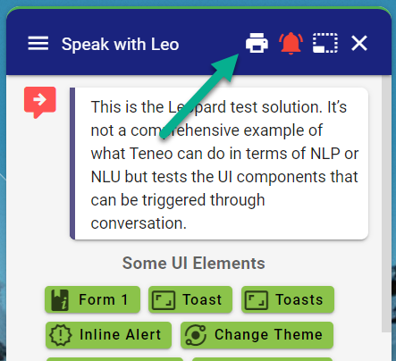
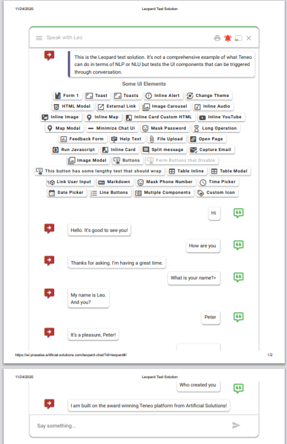

# Print Icon

## Output Parameter


This output parameter must be defined on the greeting response at the beginning of a session. The icons can be any MDI icon name. 


```text
print = {
  "icon"    : "printer",
  "color"   : "white"
}
```





