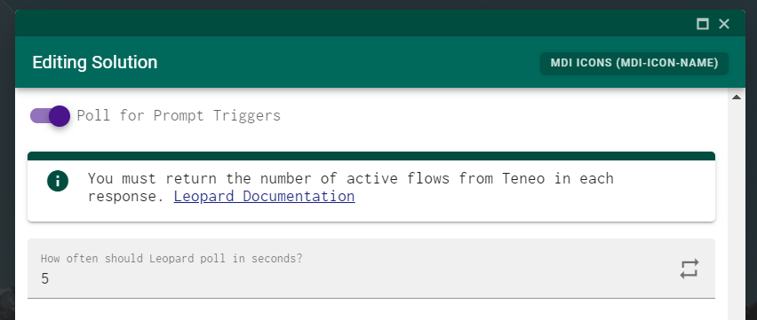
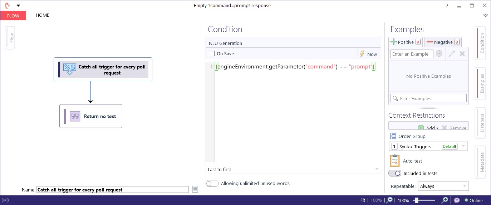

# Prompt Trigger Polling


Leopard sends no user input when polling. It does add a**`command=prompt`**request parameter to each poll request.



Your Teneo solution must return the number of active flows to Leopard for every request. This is needed so that the polling is only active when there are no active flows \(you are not mid dialog\) 



```groovy
_.putOutputParameter("numActiveFlows", "" + _.getActiveFlows().size())
```


## Screenshots






