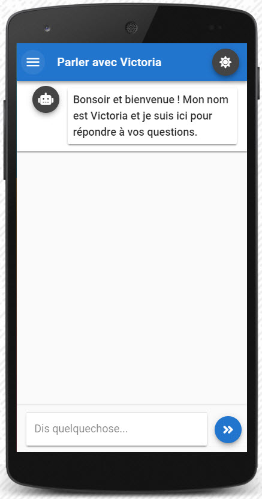
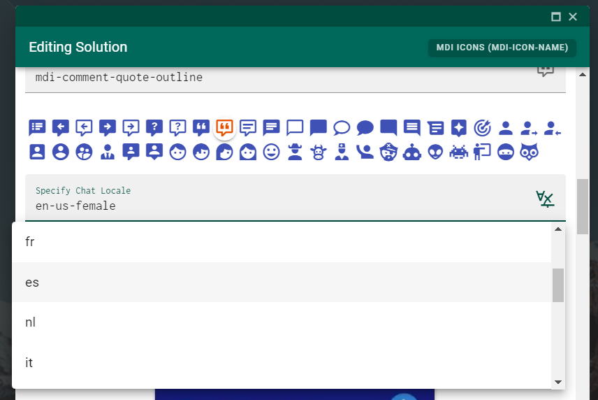
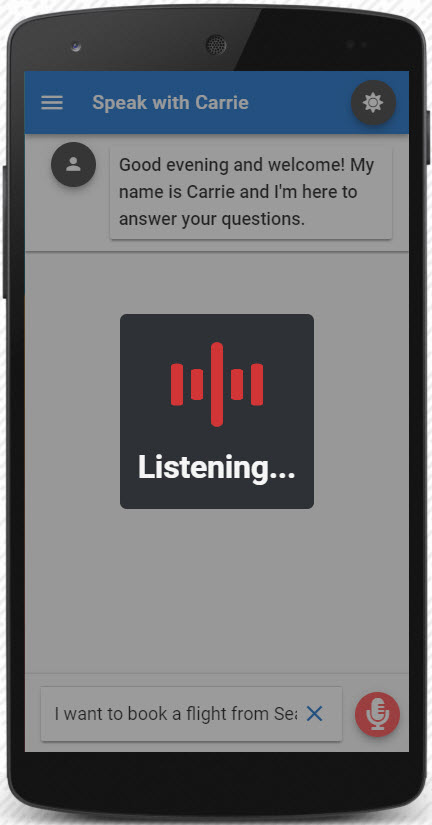

# ASR and TTS

## Supported Languages

* English
* French
* German
* Italian
* Japanese
* Danish
* Dutch
* Norwegian 
* Spanish
* Swedish
* Russian

The chat interface also has some i18n added that will change some of the labels used in Leopard to be shown in the respective language. It doesn't have full coverage of every area available in Leopards UI but it does cover the main bases.  The file used to control the labels is located in `\src\constants\translations.js`



## Configuration

In Leopard Chat Configuration UI each solution has a configuration option to change the language of the solution it's expecting to interact with. This setting also sets the ASR and TTS to be configured that respective language.



## Enable in Chat UI

 There are a few options of toggling the use of both ASR and TTS. 

* Long click on any Teneo response icon 
* Long click on the `>>` chevron or microphone icon when it's activated
* `CTL+ALT+/` or `CTL+ALT+DOWNARROW`

## Capturing Audio

 Capture audio through ASR can be done by **clicking on the microphone button** or through shortcuts:

* `CTL+ALT+UPARROW` or `CTL+ALT+.`



## Cancel Audio Capture or TTS

Useful in the following scenarios: 

* You might become tired of hearing long TTS responses or someone you're demoing to might have a question mid way through a response
* You might stutter during a ASR input and want to cancel it before it gets sent to Teneo

Cancelling both ASR input and TTS response can be done with hitting `ESC`

## ASR Corrections

Depending on the CAI use case you might find that the ASR badly transcribes some user inputs. For obvious and repeatable issues there is a corrections file in the code base that will be referenced for every ASR user input.

The file is located in  `\src\constants\asr-corrections.js` and contains a case insensitive search and replace array of arrays.


```javascript
export const ASR_CORRECTIONS = [
    ["replacethis", "with this"], 
    ["apparantly", "apparently"],
    [". coke", "diet coke"]
];
```



You can also define ASR transcription corrections at a solution configuration level. Edit a solution in the Leopard config area and there a field that allows you to define the corrections.


## TTS Override

It's quite common that you might want to have the TTS speak back a shorter response than what's displayed in the answer text. 

You can tell Leopard to speak back a specific string of text by adding the following output parameter to any output node.

```text
tts = Speak this instead of what's in the answer text
```


