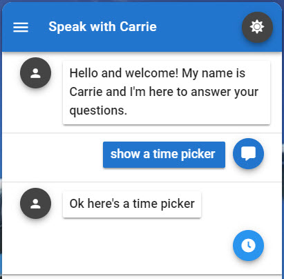
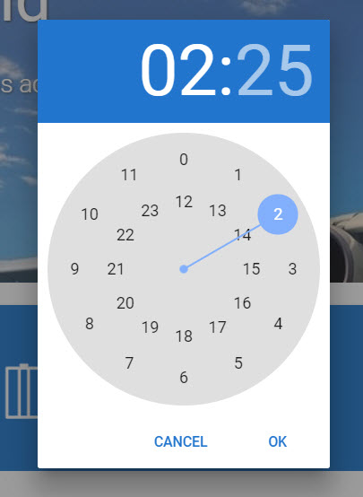

# Date & Time Pickers

## Date Picker

### Format

If you need to capture a date you can present the option to display a date picker to the user. The format of the date is currently `dd month yyyy`


### Screenshots


### Output Parameter

Showing the Date Picker is an exception to using the [ExtensionHelper](). It doesn't rely on the Extension Helper.

```groovy
datePicker = true
```

## Time Picker

### Format

The time picker uses a 24 hour format so a selection of 4am would be `04:00` and 4:35 pm would be `16:35`

### Screenshots





### Output Parameter

Showing the Time Picker is an exception to using the ExtensionHelper. It doesn't reply on the Extension Helper.

```groovy
timePicker = true
```


