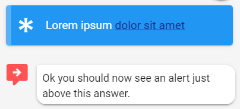

# Alerts



No ExtensionHelper available but you just need to provide and "`extensions`" output parameter with the following JSON. 

Icons are sourced from [MDI icons](https://materialdesignicons.com/) and the options for border are `["top", "right", "bottom", "right"]` or you can omit it and there will not be a sided border.

## Verbose with defaults: 

```javascript
{
   "name":"displayAlert",
   "light": false,
   "inline":true,
   "text": "Lorem ipsum <a href='https://www.google.com' target='_blank'>dolor sit amet</a>",
   "color":"blue",
   "beforeAnswer":true,
   "icon":"asterisk",
   "elevation":2,
   "dense":false,
   "prominent":false,
   "border":"left",
   "outlined":false
} 
```

## Minimal config

```javascript
{
   "name":"displayAlert",
   "inline":true,
   "text": "Lorem ipsum <a href='https://www.google.com' target='_blank'>dolor sit amet</a>",
}
```


If you place an anchor link in the text its color will be the primary color of your current Leopard theme. You can override that with a inline style tag on your anchor. Something like:

```javascript
<a href='https://www.google.com' style='color: pink' target='_blank'>dolor sit amet</a>
```



