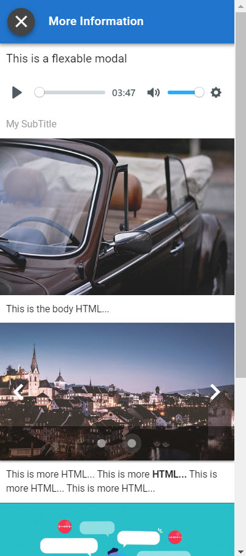

# Custom

## Screenshot



## Output Parameter

```groovy
extensions = ${ExtensionHelper.displayModal(model, template)}
```

Where `model` would be a flow or global map containing keys and values. 

### Example

```groovy
def model = [
	myTitle: "This is a flexable modal",
	mySubtitle: "My SubTitle",
	myBody: "This is the body HTML...",
	myOtherBitOfText: "This is more HTML... This is more <b>HTML...</b> This is more HTML... This is more HTML... ",
	myImage1: "https://cdn.pixabay.com/photo/2018/08/03/14/00/vw-beetle-3581950__340.jpg",
	myImage2: "https://cdn.pixabay.com/photo/2018/03/08/21/51/lake-3209994__340.jpg",
	myImageCarousel: ["https://cdn.pixabay.com/photo/2017/08/03/11/28/ferris-wheel-2575709__340.jpg", "https://cdn.pixabay.com/photo/2016/11/23/15/54/architecture-1853687__340.jpg"],
	myYouTube: "https://www.youtube.com/watch?v=rayiRwxUGdk",
	myAudio: "https://www.mfiles.co.uk/mp3-downloads/chopin-nocturne-op9-no2.mp3"
]
```

A template variable \(flow or global\) then needs to be define:

* the presentation order of the items found in the model
* the presentation component type for each item

```groovy
template = '''
title.myTitle
audio.myAudio
subtitle.mySubtitle
image.myImage1
html.myBody
carousel.myImageCarousel
html.myOtherBitOfText
youTube.myYouTube
image.myImage2
'''
```

Then add the following output parameter to an output node in Studio

```groovy
extensions = ${ExtensionHelper.displayModal(model, template)}
```

## JSON

```javascript
{
  "name"  : "displayModal",
  "items" : [
    {
      "type"  : "title",
      "value" : "This is a flexable modal"
    },
    {
      "type"  : "audio",
      "value" : "https://www.mfiles.co.uk/mp3-downloads/chopin-nocturne-op9-no2.mp3"
    },
    {
      "type"  : "subtitle",
      "value" : "My SubTitle"
    },
    {
      "type"  : "image",
      "value" : "https://cdn.pixabay.com/photo/2018/08/03/14/00/vw-beetle-3581950__340.jpg"
    },
    {
      "type"  : "html",
      "value" : "This is the body HTML..."
    },
    {
      "type"  : "carousel",
      "value" : [
        "https://cdn.pixabay.com/photo/2017/08/03/11/28/ferris-wheel-2575709__340.jpg",
        "https://cdn.pixabay.com/photo/2016/11/23/15/54/architecture-1853687__340.jpg"
      ]
    },
    {
      "type"  : "html",
      "value" : "This is more HTML... This is more <b>HTML...</b> This is more HTML... This is more HTML... "
    },
    {
      "type"  : "youTube",
      "value" : "https://www.youtube.com/watch?v=rayiRwxUGdk"
    },
    {
      "type"  : "image",
      "value" : "https://cdn.pixabay.com/photo/2018/03/08/21/51/lake-3209994__340.jpg"
    }
  ]
}
```

