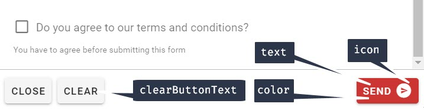

# Button

## JSON Configuration

`"button": {}` [See usage here](./#component-configuration)

| Element | Required/Optional | Default Value | Type | Notes |
| :--- | :--- | :--- | :--- | :--- |
| text | optional | Submit | String | The text shown in the button that sends the form data back to Teneo |
| icon | optional | `icon not displayed` | String | Name of an icon from [Material Design Icons](https://materialdesignicons.com/) |
| color | optional | primary | String |  Applies specified color to the button - it can be the name of material color \(for example `success` or `purple`\) or css color \(`#033` or `rgba(255, 0, 0, 0.5)`\). You can find list of built in classes on the [colors page](https://vuetifyjs.com/styles/colors#material-colors). |
| clearButtonText | optional | Clear | String | The text to show on the clear \(really reset\) form field button |



```javascript
{
   "text":"Send",
   "icon":"send-circle",
   "color":"secondary",
   "clearButtonText":"Clear"
}
```

