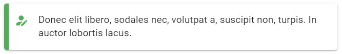

# Field Types

## Header

Simple header component `<header/>`. This component can be used to separate and announce different form elements or sections. You can pass in an array of css content classes that Vuetify makes available - more information on the available classes available here.

### Screenshot

### Config Options

| Property | Required/Optional | Default | Type | Notes |
| :--- | :--- | :--- | :--- | :--- |
| `header` | `required` | header | object |  |
| `header.label` | `required` |  | String | Text you want to display as a header |
| header.classes | optional |  | Array of Strings | Any of the classes minus the preceding period sign - [https://vuetifyjs.com/en/styles/typography](https://vuetifyjs.com/en/styles/typography) |

### JSON

```javascript
{
  "header": {
    "label": "Rugby Time",
    "classes": [
      "headline",
      "font-weight-bold"
    ]
  }
}
```

## HTML

Simple component to add any ad hoc html to your form. You can pass in an array of css content classes that Vuetify makes available - more information on the available classes available here.

Make sure your HTML is escaped correctly so that it's still valid JSON that is being passed to the "formConfig" output parameter.

### Screenshot

### Config Options

| Property | Required/Optional | Default | Type | Notes |
| :--- | :--- | :--- | :--- | :--- |
| `html` | `required` |  | object |  |
| `html.label` | `required` |  | String | HTML content |
| html.classes | optional |  | Array of Strings | Any of the classes minus the preceding period sign - [https://vuetifyjs.com/en/styles/typography](https://vuetifyjs.com/en/styles/typography) |

### JSON

```javascript
{
  "html": {
    "label": "<p>To install Vuetify, type <kbd>npm install vuetify</kbd> into your console. Once complete, type <kbd>cd <code>&lt;project name&gt;</code></kbd> and run <kbd>npm install</kbd></p>",
    "classes": [
      "body-2",
      "font-weight-regular"
    ]
  }
}
```

## Divider

Simple component that adds a `<hr/>` that can be used to separate fields or logically separate sections of your form.

### Screenshot


### Config Options

| Property | Required/Optional | Value | Type | Notes |
| :--- | :--- | :--- | :--- | :--- |
| `divider` | `required` | true | Boolean | Adds a `<hr/>` as the specific part of the form |

### JSON

```javascript
{
  "divider": true
}
```

## Alert



### Screenshot

### Config Options

| Property | Required/Optional | Default | Type | Notes |
| :--- | :--- | :--- | :--- | :--- |
| `alert` | `required` |  | Object |  |
| `alert.text` | `required` | undefined | String | The message you want to display in the alert box |
| alert.type | optional | info | String |  Specify a **success**, **info**, **warning** or **error** alert |
| alert.border | optional | left | String |  Puts a border on the alert. Accepts **top** \| **right** \| **bottom** \| **left** |
| alert.elevation | optional | 2 | Integer | Designates an elevation applied to the component between 0 and 24 |
| alert.coloredBorder | optional | true | Boolean |  Applies the **color** defined by the type to the alert's border |
| alert.dense | optional | false | Boolean | Decreases the alerts height |
| alert.prominent | optional | false | Boolean | Displays a larger vertically centered icon to draw more attention |
| alert.outlined | optional | false | Boolean | Makes the background transparent and applies a thin border |
| alert.tile | optional | false | Boolean | Removes the component's border-radius |
| alert.icon | optional | information | String | Any icon name from [https://materialdesignicons.com/](https://materialdesignicons.com/) |

### JSON

```javascript
{
  "alert": {
    "text": "Donec elit libero, sodales nec, volutpat a, suscipit non, turpis. In auctor lobortis lacus.",
    "type": "success",
    "border": "left",
    "elevation": 2,
    "coloredBorder": true,
    "dense": false,
    "prominent": false,
    "outlined": false,
    "tile": false,
    "icon": "account-edit"
  }
}
```

## Image

Simple image component. You can control the image url, alt text, and max width and max height. The max width and max height can accept a pixel input and a percentage input.

### Screenshot

### Config Options

| Property | Required/Optional | Default | Type | Notes |
| :--- | :--- | :--- | :--- | :--- |
| `image` | `required` |  | Object |  |
| `image.src` | `required` | undefined | String | The image URL |
| image.alt | optional | Random Picture | String | Alternate text for screen readers. Leave empty for decorative images |
| image.maxWidth | optional | 100% | String | Sets the maximum width for the image. Can be pixels or percentage  |
| image.maxHeight | optional | 600 | String | Sets the maximum height for the image. Can be pixels or percentage  |

### JSON

```javascript
{
  "image": {
    "alt": "RWC 2019",
    "src": "http://sportforbusiness.com/wp-content/uploads/JP-Rugby-worldcup-01.jpg",
    "maxWidth": "100%",
    "maxHeight": "600"
  }
}
```

## Input Field

Configurable text input field. You can control the initial value, styling, icon selection and placement, masking, validations, hints, counters, placeholder text, prefix/append text and more.

Many of the options are optional and sensible defaults are used.

### Screenshot


### Config Options

| Property | Required/Optional | Value | Type | Notes |
| :--- | :--- | :--- | :--- | :--- |
| `textInput` | `required` |  | Object |  |
| `textInput.name` | `required` | undefined | String | A unique camelCase name for this form element. This is the name that will be used when posting back the form data to Teneo |
| `textInput.label` | `required` | undefined | String |  |
| textInput.description | optional | undefined | String | If added produces a 2 column layout with the description in the left column. Can be used as an alternative for the [header field](field-types.md#header) |
| textInput.hint | optional | undefined | String |  |
| textInput.persistentHint | optional | true | Boolean |  |
| textInput.initialValue | optional | undefined | String | Populate the default if originally known from an integration call or gathered through conversation |
| textInput.placeHolder | optional | undefined | String |  |
| textInput.style | optional | undefined | [Style Object](style.md) | Control the look for the form field |
| textInput.clearable | optional | false | Boolean | Add input clear functionality |
| textInput.dense | optional | false | Boolean |  |
| textInput.counter | optional | false | Integer |  |
| textInput.icons | optional | undefined | Icons Object | Prepend, append icons outside and inside the field's display  |
| textInput.prefix | optional | undefined | String |  |
| textInput.suffix | optional | undefined | String |  |
| textInput.validations | optional | undefined | String | [VeeValidate validations](validation.md) can be combined together by separating them with a pipe sign \| |

### JSON

```javascript
{
  "textInput": {
    "name": "username",
    "label": "Email",
    "hint": "Just the username part please",
    "initialValue": "jolzee",
    "placeHolder": "username",
    "style": {
      "solo": true,
      "outlined": false,
      "flat": false,
      "filled": false,
      "rounded": false,
      "shaped": false,
      "soloInverted": false
    },
    "clearable": true,
    "persistentHint": true,
    "dense": false,
    "counter": 12,
    "icons": {
      "prepend": "",
      "prependInner": "",
      "append": "",
      "appendOuter": "email-edit"
    },
    "prefix": "",
    "suffix": "@gmail.com",
    "validations": "required"
  }
}
```

## Text Area

Configurable text area field. You can control the initial value, styling, icon selection and placement, masking, validations, hints, placeholder text, counters, rows, auto grow, prefix/append text and more.

Many of the options are optional and sensible defaults are used.

### Screenshot


### Config Options

| Property | Required/Optional | Default | Type | Notes |
| :--- | :--- | :--- | :--- | :--- |
| `textarea` | `required` |  | Object |  |
| `textarea.name` | `required` | undefined | String |  |
| `textarea.label` | `required` | undefined | String |  |
| textInput.description | optional | undefined | String | If added produces a 2 column layout with the description in the left column. Can be used as an alternative for the [header field](field-types.md#header) |
| textarea.hint | optional | undefined | String |  |
| textarea.initialValue | optional | undefined | String |  |
| textarea.autoGrow | optional | true | Boolean |  |
| textarea.placeHolder | optional | undefined | String |  |
| textInput.style | optional | undefined | [Style Object](style.md) | Control the look for the form field |
| textarea.clearable | optional | false | Boolean |  |
| textarea.persistentHint | optional | false | Boolean |  |
| textarea.rows | optional | 5 | Integer |  |
| textarea.dense | optional | false | Boolean |  |
| textarea.counter | optional | undefined | Integer |  |
| textarea.prefix | optional | undefined | String |  |
| textarea.suffix | optional | undefined | String |  |
| textarea.icons | optional |  | Icons Object |  |
| textarea.validations | optional | undefined | String | [VeeValidate validations](validation.md) can be combined together by separating them with a pipe sign \| |

### JSON

```javascript
{
  "textarea": {
    "name": "bio",
    "label": "Write a bio for yourself",
    "description": "Please write a Bio about yourself.",
    "hint": "Keep it brief and to the point",
    "initialValue": "Bacon ipsum dolor amet rump ham hock sirloin doner fatback beef kielbasa picanha leberkas sausage buffalo capicola. Shoulder tail pancetta tenderloin. ",
    "autoGrow": true,
    "placeHolder": "Peter Joles is a Sales Engineer at Artificial Solutions...",
    "style": {
      "solo": false,
      "outlined": false,
      "flat": false,
      "filled": true,
      "rounded": false,
      "shaped": false,
      "soloInverted": false
    },
    "clearable": true,
    "persistentHint": true,
    "rows": 5,
    "dense": false,
    "counter": 12,
    "prefix": "",
    "suffix": "",
    "icons": {
      "prepend": "",
      "prependInner": "",
      "append": "",
      "appendOuter": "file-document-edit"
    },
    "validations": "required"
  }
}
```

## Select

Configurable select field. You can control the initial value, options, styling, icon selection and placement, validations, hints, placeholder text and more.

Many of the options are optional and sensible defaults are used.

### Screenshot

### Config Options

| Property | Required/Optional | Default | Type | Notes |
| :--- | :--- | :--- | :--- | :--- |
| `select` | `required` | select | Object |  |
| `select.name` | `required` | undefined | String |  |
| `select.label` | `required` | undefined | String |  |
| textInput.description | optional | undefined | String | If added produces a 2 column layout with the description in the left column. Can be used as an alternative for the [header field](field-types.md#header) |
| select.hint | optional | undefined | String |  |
| select.initialValue | optional | undefined | String |  |
| select.chips | optional | false | Boolean |  |
| select.deletableChips | optional | true | Boolean |  |
| select.persistentHint | optional | true | Boolean |  |
| select.clearable | optional | true | Boolean |  |
| select.multiple | optional | false | Boolean |  |
| select.dense | optional | false | Boolean |  |
| select.hideSelected | optional | true | Boolean |  |
| select.items | optional | undefined | Array of Strings |  |
| select.style | optional | optional | String |  |
| select.icons | optional | undefined | Icons Object |  |
| select.validations | optional | undefined | String | [VeeValidate validations](validation.md) can be combined together by separating them with a pipe sign \| |

### JSON

```javascript
{
  "select": {
    "name": "favoriteRugbyTeam",
    "label": "What's your favorite Rugby Team",
    "hint": "Go with the Green and Gold",
    "initialValue": [
      "South Africa"
    ],
    "chips": true,
    "deletableChips": false,
    "persistentHint": true,
    "clearable": true,
    "multiple": false,
    "dense": false,
    "hideSelected": true,
    "items": [
      "England",
      "South Africa",
      "New Zealand"
    ],
    "style": {
      "solo": true,
      "outlined": false,
      "flat": false,
      "filled": false,
      "rounded": false,
      "shaped": false,
      "soloInverted": false
    },
    "icons": {
      "prepend": "",
      "prependInner": "",
      "append": "",
      "appendOuter": "football-australian"
    },
    "validations": "required"
  }
}
```

## Combo Box

Configurable combo box field. This field can allow multiple items to be selected. You can control the initial selections, selectable options, styling, icon selection, validations, hints, placeholder text and more.

Many of the options are optional and sensible defaults are used.

### Screenshot

### Config Options

| Element | Required/Optional | Default | Type | Notes |
| :--- | :--- | :--- | :--- | :--- |
| `comboBox` | `required` |  | Object |  |
| `comboBox.name` | `required` | undefined | String |  |
| `comboBox.label` | `required` | undefined | String |  |
| textInput.description | optional | undefined | String | If added produces a 2 column layout with the description in the left column. Can be used as an alternative for the [header field](field-types.md#header) |
| comboBox.hint | optional | undefined | String |  |
| comboBox.persistentHint | optional | true | Boolean |  |
| comboBox.chips | optional | false | Boolean |  |
| comboBox.multiple | optional | true | Boolean |  |
| comboBox.hideSelected | optional | true | Boolean |  |
| comboBox.deletableChips | optional | true | Boolean |  |
| comboBox.clearable | optional | true | Boolean |  |
| comboBox.dense | optional | false | Boolean |  |
| comboBox.items | optional | undefined | Array of Objects |  |
| comboBox.style | optional | undefined | String |  |
| openOnClear | optional | false | Boolean |  |
| comboBox.icons | optional | undefined | Icons Object |  |
| comboBox.validations | optional | undefined | String | [VeeValidate validations](validation.md) can be combined together by separating them with a pipe sign \| |

### JSON

```javascript
{
  "comboBox": {
    "name": "skills",
    "label": "What programming skill do you have?",
    "hint": "Don't worry if we don't have a skill listed",
    "chips": true,
    "multiple": true,
    "hideSelected": false,
    "deletableChips": true,
    "clearable": true,
    "dense": false,
    "items": [
      {
        "text": "Java",
        "value": "java"
      },
      {
        "text": "Node JS",
        "value": "nodejs"
      }
    ],
    "style": {
      "solo": true,
      "outlined": false,
      "flat": false,
      "filled": false,
      "rounded": false,
      "shaped": false,
      "soloInverted": false
    },
    "openOnClear": false,
    "icons": {
      "prepend": "",
      "prependInner": "",
      "append": "",
      "appendOuter": "code-braces"
    },
    "validations": "required"
  }
}
```

## Check Box

Configurable checkbox field. You can control the label, styling, icon selection, validations and hints

Many of the options are optional and sensible defaults are used.

### Screenshot

### Config Options

| Property | Required/Optional | Default | Type | Notes |
| :--- | :--- | :--- | :--- | :--- |
| `checkbox` | `required` |  | Object |  |
| `checkbox.name` | `required` | undefined | String |  |
| `checkbox.label` | `required` | undefined | String |  |
| textInput.description | optional | undefined | String | If added produces a 2 column layout with the description in the left column. Can be used as an alternative for the [header field](field-types.md#header) |
| checkbox.hint | optional | undefined | String |  |
| checkbox.persistentHint | optional | true | Boolean |  |
| checkbox.dense | optional | false | Boolean |  |
| checkbox.initialValue | optional | undefined | String |  |
| checkbox.validations | optional | undefined | String | [VeeValidate validations](validation.md) can be combined together by separating them with a pipe sign \| |

### JSON

```javascript
{
  "checkbox": {
    "name": "agreedToTerms",
    "label": "Do you agree to our terms and conditions?",
    "hint": "You have to agree before submitting this form",
    "persistentHint": true,
    "dense": false,
    "initialValue": false,
    "validations": "required"
  }
}
```

## Switch

Configurable switch field that returns either true or false based on the operation on the switch. You can control the styling, icon selection, validations, hints, placeholder text and more.

Many of the options are optional and sensible defaults are used.

### Screenshot

### Config Options

| Property | Required/Optional | Default | Type | Notes |
| :--- | :--- | :--- | :--- | :--- |
| `switch` | `required` |  | Object |  |
| `switch.name` | `required` | undefined | String |  |
| `switch.label` | `required` | undefined | String |  |
| textInput.description | optional | undefined | String | If added produces a 2 column layout with the description in the left column. Can be used as an alternative for the [header field](field-types.md#header) |
| switch.persistentHint | optional | true | Boolean |  |
| switch.dense | optional | false | Boolean |  |
| switch.hint | optional | undefined | String |  |
| switch.initialValue | optional | undefined | String |  |
| switch.inset | optional | false | Boolean |  |
| switch.validations | optional | undefined | String | [VeeValidate validations](validation.md) can be combined together by separating them with a pipe sign \| |

### JSON

```javascript
{
  "switch": {
    "name": "newsLetter",
    "label": "Do you want to receive our monthly newsletter?",
    "persistentHint": false,
    "dense": false,
    "hint": "We won't spam - ever!",
    "initialValue": true,
    "inset": false
  }
}
```

## Radio Buttons

Configurable radio button group field. You can control the options, styling, icon selection, validations, hints and more.

Many of the options are optional and sensible defaults are used.

### Screenshot

### Config Options

<table>
  <thead>
    <tr>
      <th style="text-align:left">Property</th>
      <th style="text-align:left">Required/Optional</th>
      <th style="text-align:left">Default</th>
      <th style="text-align:left">Type</th>
      <th style="text-align:left">Notes</th>
    </tr>
  </thead>
  <tbody>
    <tr>
      <td style="text-align:left"><code>radio</code>
      </td>
      <td style="text-align:left"><code>required</code>
      </td>
      <td style="text-align:left"></td>
      <td style="text-align:left">Object</td>
      <td style="text-align:left"></td>
    </tr>
    <tr>
      <td style="text-align:left"><code>radio.name</code>
      </td>
      <td style="text-align:left"><code>required</code>
      </td>
      <td style="text-align:left">undefined</td>
      <td style="text-align:left">String</td>
      <td style="text-align:left"></td>
    </tr>
    <tr>
      <td style="text-align:left"><code>radio.label</code>
      </td>
      <td style="text-align:left"><code>required</code>
      </td>
      <td style="text-align:left">undefined</td>
      <td style="text-align:left">String</td>
      <td style="text-align:left"></td>
    </tr>
    <tr>
      <td style="text-align:left">textInput.description</td>
      <td style="text-align:left">optional</td>
      <td style="text-align:left">undefined</td>
      <td style="text-align:left">String</td>
      <td style="text-align:left">If added produces a 2 column layout with the description in the left column.
        Can be used as an alternative for the <a href="field-types.md#header">header field</a>
      </td>
    </tr>
    <tr>
      <td style="text-align:left">radio.dense</td>
      <td style="text-align:left">optional</td>
      <td style="text-align:left">false</td>
      <td style="text-align:left">Boolean</td>
      <td style="text-align:left"></td>
    </tr>
    <tr>
      <td style="text-align:left">radio.hint</td>
      <td style="text-align:left">optional</td>
      <td style="text-align:left">undefined</td>
      <td style="text-align:left">String</td>
      <td style="text-align:left"></td>
    </tr>
    <tr>
      <td style="text-align:left">radio.persistentHint</td>
      <td style="text-align:left">optional</td>
      <td style="text-align:left">true</td>
      <td style="text-align:left">Boolean</td>
      <td style="text-align:left"></td>
    </tr>
    <tr>
      <td style="text-align:left">radio.mandatory</td>
      <td style="text-align:left">optional</td>
      <td style="text-align:left">false</td>
      <td style="text-align:left">Boolean</td>
      <td style="text-align:left"></td>
    </tr>
    <tr>
      <td style="text-align:left">radio.multiple</td>
      <td style="text-align:left">optional</td>
      <td style="text-align:left">false</td>
      <td style="text-align:left">Boolean</td>
      <td style="text-align:left"></td>
    </tr>
    <tr>
      <td style="text-align:left">radio.row</td>
      <td style="text-align:left">optional</td>
      <td style="text-align:left">false</td>
      <td style="text-align:left">Integer</td>
      <td style="text-align:left">Displays radio buttons in row</td>
    </tr>
    <tr>
      <td style="text-align:left">radio.items</td>
      <td style="text-align:left">optional</td>
      <td style="text-align:left">undefined</td>
      <td style="text-align:left">Array of Objects</td>
      <td style="text-align:left">
        <p><code>[{ </code>
        </p>
        <p><code>&quot;label&quot;: &quot;The radio label&quot;, </code>
        </p>
        <p><code>&quot;value&quot;: &quot;theFormValue&quot; }]</code>
        </p>
      </td>
    </tr>
    <tr>
      <td style="text-align:left">radio.icons</td>
      <td style="text-align:left">optional</td>
      <td style="text-align:left">undefined</td>
      <td style="text-align:left">Object</td>
      <td style="text-align:left"></td>
    </tr>
    <tr>
      <td style="text-align:left">radio.validations</td>
      <td style="text-align:left">optional</td>
      <td style="text-align:left">undefined</td>
      <td style="text-align:left">String</td>
      <td style="text-align:left"><a href="validation.md">VeeValidate validations</a> can be combined together
        by separating them with a pipe sign |</td>
    </tr>
  </tbody>
</table>### JSON

```javascript
{
  "radio": {
    "name": "ageRange",
    "label": "What's you age range?",
    "dense": false,
    "hint": "Please don't lie 😁",
    "persistentHint": true,
    "mandatory": true,
    "multiple": false,
    "row": false,
    "items": [
      {
        "label": "18-25",
        "value": "18to25"
      },
      {
        "label": "26-45",
        "value": "26to45"
      }
    ],
    "icons": {
      "prepend": "gesture-tap-hold",
      "append": ""
    }
  }
}
```


