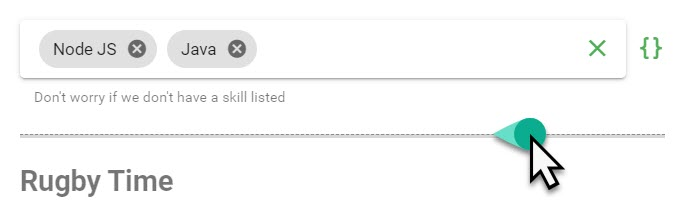
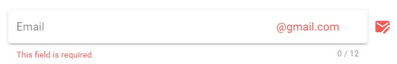
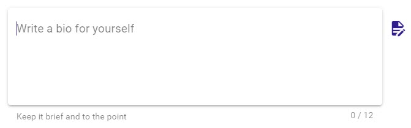

# Field Types

## Header

Simple header component `<header/>`. This component can be used to separate and announce different form elements or sections. You can pass in an array of css content classes that Vuetify makes available - more information on the available classes available here.

### Screenshot

### Config Options

| Property | Required/Optional | Default | Type | Notes |
| :--- | :--- | :--- | :--- | :--- |
| `header` | `required` | header | object |  |
| `header.label` | `required` |  | String | Text you want to display as a header |
| header.classes | optional |  | Array of Strings | Any of the classes minus the preceding period sign - [https://vuetifyjs.com/en/styles/typography](https://vuetifyjs.com/en/styles/typography) |

### JSON

```javascript
{
  "header": {
    "label": "Rugby Time",
    "classes": [
      "headline",
      "font-weight-bold"
    ]
  }
}
```

## HTML

Simple component to add any ad hoc html to your form. You can pass in an array of css content classes that Vuetify makes available - more information on the available classes available here.

Make sure your HTML is escaped correctly so that it's still valid JSON that is being passed to the "formConfig" output parameter.

### Screenshot

### Config Options

| Property | Required/Optional | Default | Type | Notes |
| :--- | :--- | :--- | :--- | :--- |
| `html` | `required` |  | object |  |
| `html.label` | `required` |  | String | HTML content |
| html.classes | optional |  | Array of Strings | Any of the classes minus the preceding period sign - [https://vuetifyjs.com/en/styles/typography](https://vuetifyjs.com/en/styles/typography) |

### JSON

```javascript
{
  "html": {
    "label": "<p>To install Vuetify, type <kbd>npm install vuetify</kbd> into your console. Once complete, type <kbd>cd <code>&lt;project name&gt;</code></kbd> and run <kbd>npm install</kbd></p>",
    "classes": [
      "body-2",
      "font-weight-regular"
    ]
  }
}
```

## Divider

Simple component that adds a `<hr/>` that can be used to separate fields or logically separate sections of your form.

### Screenshot



### Config Options

| Property | Required/Optional | Value | Type | Notes |
| :--- | :--- | :--- | :--- | :--- |
| `divider` | `required` | true | Boolean | Adds a `<hr/>` as the specific part of the form |

### JSON

```javascript
{
  "divider": true
}
```

## Alert


### Screenshot

### Config Options

| Property | Required/Optional | Default | Type | Notes |
| :--- | :--- | :--- | :--- | :--- |
| `alert` | `required` |  | Object |  |
| `alert.text` | `required` | undefined | String | The message you want to display in the alert box |
| alert.type | optional | info | String | Specify a **success**, **info**, **warning** or **error** alert |
| alert.border | optional | left | String | Puts a border on the alert. Accepts **top** \| **right** \| **bottom** \| **left** |
| alert.elevation | optional | 2 | Integer | Designates an elevation applied to the component between 0 and 24 |
| alert.coloredBorder | optional | true | Boolean | Applies the **color** defined by the type to the alert's border |
| alert.dense | optional | false | Boolean | Decreases the alerts height |
| alert.prominent | optional | false | Boolean | Displays a larger vertically centered icon to draw more attention |
| alert.outlined | optional | false | Boolean | Makes the background transparent and applies a thin border |
| alert.tile | optional | false | Boolean | Removes the component's border-radius |
| alert.icon | optional | information | String | Any icon name from [https://materialdesignicons.com/](https://materialdesignicons.com/) |

### JSON

```javascript
{
  "alert": {
    "text": "Donec elit libero, sodales nec, volutpat a, suscipit non, turpis. In auctor lobortis lacus.",
    "type": "success",
    "border": "left",
    "elevation": 2,
    "coloredBorder": true,
    "dense": false,
    "prominent": false,
    "outlined": false,
    "tile": false,
    "icon": "account-edit"
  }
}
```

## Image

Simple image component. You can control the image url, alt text, and max width and max height. The max width and max height can accept a pixel input and a percentage input.

### Screenshot

### Config Options

| Property | Required/Optional | Default | Type | Notes |
| :--- | :--- | :--- | :--- | :--- |
| `image` | `required` |  | Object |  |
| `image.src` | `required` | undefined | String | The image URL |
| image.alt | optional | Random Picture | String | Alternate text for screen readers. Leave empty for decorative images |
| image.maxWidth | optional | 100% | String | Sets the maximum width for the image. Can be pixels or percentage  |
| image.maxHeight | optional | 600 | String | Sets the maximum height for the image. Can be pixels or percentage  |

### JSON

```javascript
{
  "image": {
    "alt": "RWC 2019",
    "src": "http://sportforbusiness.com/wp-content/uploads/JP-Rugby-worldcup-01.jpg",
    "maxWidth": "100%",
    "maxHeight": "600"
  }
}
```

## Input Field

Configurable text input field. You can control the initial value, styling, icon selection and placement, masking, validations, hints, counters, placeholder text, prefix/append text and more.

Many of the options are optional and sensible defaults are used.

### Screenshots





### Config Options

| Property | Required/Optional | Value | Type | Notes |
| :--- | :--- | :--- | :--- | :--- |
| `textInput` | `required` |  | Object |  |
| `textInput.name` | `required` | undefined | String | A unique `camelCase` name for this form element. This is the name that will be used when posting back the form data to Teneo |
| `textInput.label` | `required` | undefined | String | Sets input label |
| textInput.description | optional | undefined | String | If added produces a 2 column layout with the description in the left column. Can be used as an alternative for the [header field](field-types.md#header) |
| textInput.hint | optional | undefined | String | Hint text |
| textInput.persistentHint | optional | true | Boolean | Forces hint to always be visible |
| textInput.initialValue | optional | undefined | String | Populate the default if originally known from an integration call or gathered through conversation |
| textInput.placeHolder | optional | undefined | String | Sets the input’s placeholder text |
| textInput.style | optional | undefined | [Style Object](style.md) | Control the look for the form field |
| textInput.clearable | optional | false | Boolean | Add input clear functionality |
| textInput.dense | optional | false | Boolean | Reduces the input height |
| textInput.counter | optional | false | Integer | Creates counter for input length; if no number is specified, it defaults to 25. Does not apply any validation. |
| textInput.icons | optional | undefined | [Icons Object](icons-object.md) | Prepend, append icons outside and inside the field's display  |
| textInput.prefix | optional | undefined | String | Displays prefix text |
| textInput.suffix | optional | undefined | String | Displays suffix text |
| textInput.validations | optional | undefined | String | [VeeValidate validations](validation.md) can be combined together by separating them with a pipe sign \| |

### JSON

```javascript
{
  "textInput": {
    "name": "username",
    "label": "Email",
    "hint": "Just the username part please",
    "initialValue": "jolzee",
    "placeHolder": "username",
    "style": {
      "solo": true,
      "outlined": false,
      "flat": false,
      "filled": false,
      "rounded": false,
      "shaped": false,
      "soloInverted": false
    },
    "clearable": true,
    "persistentHint": true,
    "dense": false,
    "counter": 12,
    "icons": {
      "prepend": "",
      "prependInner": "",
      "append": "",
      "appendOuter": "email-edit"
    },
    "prefix": "",
    "suffix": "@gmail.com",
    "validations": "required"
  }
}
```

## Text Area

Configurable text area field. You can control the initial value, styling, icon selection and placement, masking, validations, hints, placeholder text, counters, rows, auto grow, prefix/append text and more.

Many of the options are optional and sensible defaults are used.

### Screenshot



### Config Options

| Property | Required/Optional | Default | Type | Notes |
| :--- | :--- | :--- | :--- | :--- |
| `textarea` | `required` |  | Object |  |
| `textarea.name` | `required` | undefined | String | A unique `camelCase` name for this form element. This is the name that will be used when posting back the form data to Teneo |
| `textarea.label` | `required` | undefined | String | Sets input label |
| textInput.description | optional | undefined | String | If added produces a 2 column layout with the description in the left column. Can be used as an alternative for the [header field](field-types.md#header) |
| textarea.hint | optional | undefined | String | Hint text |
| textarea.initialValue | optional | undefined | String | Populate the default if originally known from an integration call or gathered through conversation |
| textarea.autoGrow | optional | true | Boolean | Automatically grow the textarea depending on amount of text |
| textarea.placeHolder | optional | undefined | String | Sets the input’s placeholder text |
| textInput.style | optional | undefined | [Style Object](style.md) | Control the look for the form field |
| textarea.clearable | optional | false | Boolean | Add input clear functionality |
| textarea.persistentHint | optional | false | Boolean | Forces hint to always be visible |
| textarea.rows | optional | 5 | Integer | Default row count |
| textarea.dense | optional | false | Boolean | Reduces the input height |
| textarea.counter | optional | undefined | Integer | Creates counter for input length; if no number is specified, it defaults to 25. Does not apply any validation. |
| textarea.prefix | optional | undefined | String | Displays prefix text |
| textarea.suffix | optional | undefined | String | Displays suffix text |
| textarea.icons | optional | undefined | [Icons Object](icons-object.md) | Prepend, append icons outside and inside the field's display |
| textarea.validations | optional | undefined | String | [VeeValidate validations](validation.md) can be combined together by separating them with a pipe sign \| |

### JSON

```javascript
{
  "textarea": {
    "name": "bio",
    "label": "Write a bio for yourself",
    "description": "Please write a Bio about yourself.",
    "hint": "Keep it brief and to the point",
    "initialValue": "Bacon ipsum dolor amet rump ham hock sirloin doner fatback beef kielbasa picanha leberkas sausage buffalo capicola. Shoulder tail pancetta tenderloin. ",
    "autoGrow": true,
    "placeHolder": "Peter Joles is a Sales Engineer at Artificial Solutions...",
    "style": {
      "solo": false,
      "outlined": false,
      "flat": false,
      "filled": true,
      "rounded": false,
      "shaped": false,
      "soloInverted": false
    },
    "clearable": true,
    "persistentHint": true,
    "rows": 5,
    "dense": false,
    "counter": 12,
    "prefix": "",
    "suffix": "",
    "icons": {
      "prepend": "",
      "prependInner": "",
      "append": "",
      "appendOuter": "file-document-edit"
    },
    "validations": "required"
  }
}
```

## Select

Configurable select field. You can control the initial value, options, styling, icon selection and placement, validations, hints, placeholder text and more.

Many of the options are optional and sensible defaults are used.

### Screenshot

### Config Options

<table>
  <thead>
    <tr>
      <th style="text-align:left">Property</th>
      <th style="text-align:left">Required/Optional</th>
      <th style="text-align:left">Default</th>
      <th style="text-align:left">Type</th>
      <th style="text-align:left">Notes</th>
    </tr>
  </thead>
  <tbody>
    <tr>
      <td style="text-align:left"><code>select</code>
      </td>
      <td style="text-align:left"><code>required</code>
      </td>
      <td style="text-align:left">select</td>
      <td style="text-align:left">Object</td>
      <td style="text-align:left"></td>
    </tr>
    <tr>
      <td style="text-align:left"><code>select.name</code>
      </td>
      <td style="text-align:left"><code>required</code>
      </td>
      <td style="text-align:left">undefined</td>
      <td style="text-align:left">String</td>
      <td style="text-align:left">A unique <code>camelCase</code> name for this form element. This is the
        name that will be used when posting back the form data to Teneo</td>
    </tr>
    <tr>
      <td style="text-align:left"><code>select.label</code>
      </td>
      <td style="text-align:left"><code>required</code>
      </td>
      <td style="text-align:left">undefined</td>
      <td style="text-align:left">String</td>
      <td style="text-align:left">Sets input label</td>
    </tr>
    <tr>
      <td style="text-align:left">select.description</td>
      <td style="text-align:left">optional</td>
      <td style="text-align:left">undefined</td>
      <td style="text-align:left">String</td>
      <td style="text-align:left">If added produces a 2 column layout with the description in the left column.
        Can be used as an alternative for the <a href="field-types.md#header">header field</a>
      </td>
    </tr>
    <tr>
      <td style="text-align:left">select.hint</td>
      <td style="text-align:left">optional</td>
      <td style="text-align:left">undefined</td>
      <td style="text-align:left">String</td>
      <td style="text-align:left">Hint text</td>
    </tr>
    <tr>
      <td style="text-align:left">select.initialValue</td>
      <td style="text-align:left">optional</td>
      <td style="text-align:left">undefined</td>
      <td style="text-align:left">String</td>
      <td style="text-align:left">Populate the default if originally known from an integration call or gathered
        through conversation</td>
    </tr>
    <tr>
      <td style="text-align:left">select.chips</td>
      <td style="text-align:left">optional</td>
      <td style="text-align:left">false</td>
      <td style="text-align:left">Boolean</td>
      <td style="text-align:left">Changes display of selections to chips</td>
    </tr>
    <tr>
      <td style="text-align:left">select.deletableChips</td>
      <td style="text-align:left">optional</td>
      <td style="text-align:left">true</td>
      <td style="text-align:left">Boolean</td>
      <td style="text-align:left">Adds a remove icon to selected chips</td>
    </tr>
    <tr>
      <td style="text-align:left">select.persistentHint</td>
      <td style="text-align:left">optional</td>
      <td style="text-align:left">true</td>
      <td style="text-align:left">Boolean</td>
      <td style="text-align:left">Forces hint to always be visible</td>
    </tr>
    <tr>
      <td style="text-align:left">select.clearable</td>
      <td style="text-align:left">optional</td>
      <td style="text-align:left">true</td>
      <td style="text-align:left">Boolean</td>
      <td style="text-align:left">Add input clear functionality</td>
    </tr>
    <tr>
      <td style="text-align:left">select.multiple</td>
      <td style="text-align:left">optional</td>
      <td style="text-align:left">false</td>
      <td style="text-align:left">Boolean</td>
      <td style="text-align:left">Changes select to multiple</td>
    </tr>
    <tr>
      <td style="text-align:left">select.dense</td>
      <td style="text-align:left">optional</td>
      <td style="text-align:left">false</td>
      <td style="text-align:left">Boolean</td>
      <td style="text-align:left">Reduces the input height</td>
    </tr>
    <tr>
      <td style="text-align:left">select.hideSelected</td>
      <td style="text-align:left">optional</td>
      <td style="text-align:left">true</td>
      <td style="text-align:left">Boolean</td>
      <td style="text-align:left">Hide items from the drop down that have already been selected</td>
    </tr>
    <tr>
      <td style="text-align:left">select.items</td>
      <td style="text-align:left">optional</td>
      <td style="text-align:left">undefined</td>
      <td style="text-align:left">Array of Strings</td>
      <td style="text-align:left"><code>[&quot;South Africa&quot;, &quot;England&quot;, &quot;U.S.A.&quot;]</code>
      </td>
    </tr>
    <tr>
      <td style="text-align:left">select.style</td>
      <td style="text-align:left">optional</td>
      <td style="text-align:left">optional</td>
      <td style="text-align:left"><a href="style.md">Style Object</a>
      </td>
      <td style="text-align:left">
        <p></p>
        <p>Control the look for the form field</p>
      </td>
    </tr>
    <tr>
      <td style="text-align:left">select.icons</td>
      <td style="text-align:left">optional</td>
      <td style="text-align:left">undefined</td>
      <td style="text-align:left"><a href="icons-object.md">Icons Object</a>
      </td>
      <td style="text-align:left">Prepend, append icons outside and inside the field&apos;s display</td>
    </tr>
    <tr>
      <td style="text-align:left">select.validations</td>
      <td style="text-align:left">optional</td>
      <td style="text-align:left">undefined</td>
      <td style="text-align:left">String</td>
      <td style="text-align:left"><a href="validation.md">VeeValidate validations</a> can be combined together
        by separating them with a pipe sign |</td>
    </tr>
  </tbody>
</table>### JSON

```javascript
{
  "select": {
    "name": "favoriteRugbyTeam",
    "label": "What's your favorite Rugby Team",
    "hint": "Go with the Green and Gold",
    "initialValue": "South Africa",
    "chips": true,
    "deletableChips": false,
    "persistentHint": true,
    "clearable": true,
    "multiple": false,
    "dense": false,
    "hideSelected": true,
    "items": [
      "England",
      "South Africa",
      "New Zealand"
    ],
    "style": {
      "solo": true,
      "outlined": false,
      "flat": false,
      "filled": false,
      "rounded": false,
      "shaped": false,
      "soloInverted": false
    },
    "icons": {
      "prepend": "",
      "prependInner": "",
      "append": "",
      "appendOuter": "football-australian"
    },
    "validations": "required"
  }
}
```

## Combo Box

Configurable combo box field. This field can allow multiple items to be selected. You can control the initial selections, selectable options, styling, icon selection, validations, hints, placeholder text and more.

Many of the options are optional and sensible defaults are used.

### Screenshot


### Config Options

<table>
  <thead>
    <tr>
      <th style="text-align:left">Element</th>
      <th style="text-align:left">Required/Optional</th>
      <th style="text-align:left">Default</th>
      <th style="text-align:left">Type</th>
      <th style="text-align:left">Notes</th>
    </tr>
  </thead>
  <tbody>
    <tr>
      <td style="text-align:left"><code>comboBox</code>
      </td>
      <td style="text-align:left"><code>required</code>
      </td>
      <td style="text-align:left"></td>
      <td style="text-align:left">Object</td>
      <td style="text-align:left"></td>
    </tr>
    <tr>
      <td style="text-align:left"><code>comboBox.name</code>
      </td>
      <td style="text-align:left"><code>required</code>
      </td>
      <td style="text-align:left">undefined</td>
      <td style="text-align:left">String</td>
      <td style="text-align:left">A unique <code>camelCase</code> name for this form element. This is the
        name that will be used when posting back the form data to Teneo</td>
    </tr>
    <tr>
      <td style="text-align:left"><code>comboBox.label</code>
      </td>
      <td style="text-align:left"><code>required</code>
      </td>
      <td style="text-align:left">undefined</td>
      <td style="text-align:left">String</td>
      <td style="text-align:left">Sets input label</td>
    </tr>
    <tr>
      <td style="text-align:left">comboBox.description</td>
      <td style="text-align:left">optional</td>
      <td style="text-align:left">undefined</td>
      <td style="text-align:left">String</td>
      <td style="text-align:left">If added produces a 2 column layout with the description in the left column.
        Can be used as an alternative for the <a href="field-types.md#header">header field</a>
      </td>
    </tr>
    <tr>
      <td style="text-align:left">comboBox.hint</td>
      <td style="text-align:left">optional</td>
      <td style="text-align:left">undefined</td>
      <td style="text-align:left">String</td>
      <td style="text-align:left">Hint text</td>
    </tr>
    <tr>
      <td style="text-align:left">comboBox.persistentHint</td>
      <td style="text-align:left">optional</td>
      <td style="text-align:left">true</td>
      <td style="text-align:left">Boolean</td>
      <td style="text-align:left">Forces hint to always be visible</td>
    </tr>
    <tr>
      <td style="text-align:left">comboBox.chips</td>
      <td style="text-align:left">optional</td>
      <td style="text-align:left">false</td>
      <td style="text-align:left">Boolean</td>
      <td style="text-align:left">Changes display of selections to chips</td>
    </tr>
    <tr>
      <td style="text-align:left">comboBox.multiple</td>
      <td style="text-align:left">optional</td>
      <td style="text-align:left">true</td>
      <td style="text-align:left">Boolean</td>
      <td style="text-align:left">Changes combo box to multiple</td>
    </tr>
    <tr>
      <td style="text-align:left">comboBox.hideSelected</td>
      <td style="text-align:left">optional</td>
      <td style="text-align:left">true</td>
      <td style="text-align:left">Boolean</td>
      <td style="text-align:left">Do not display in the select menu items that are already selected</td>
    </tr>
    <tr>
      <td style="text-align:left">comboBox.deletableChips</td>
      <td style="text-align:left">optional</td>
      <td style="text-align:left">true</td>
      <td style="text-align:left">Boolean</td>
      <td style="text-align:left">Adds a remove icon to selected chips</td>
    </tr>
    <tr>
      <td style="text-align:left">comboBox.clearable</td>
      <td style="text-align:left">optional</td>
      <td style="text-align:left">true</td>
      <td style="text-align:left">Boolean</td>
      <td style="text-align:left">Add input clear functionality</td>
    </tr>
    <tr>
      <td style="text-align:left">comboBox.dense</td>
      <td style="text-align:left">optional</td>
      <td style="text-align:left">false</td>
      <td style="text-align:left">Boolean</td>
      <td style="text-align:left">Reduces the input height</td>
    </tr>
    <tr>
      <td style="text-align:left">comboBox.items</td>
      <td style="text-align:left">optional</td>
      <td style="text-align:left">undefined</td>
      <td style="text-align:left">Array of Objects</td>
      <td style="text-align:left">
        <p><code>[ </code>
        </p>
        <p><code> { </code>
        </p>
        <p><code>   &quot;text&quot;: &quot;Java&quot;, </code>
        </p>
        <p><code>   &quot;value&quot;: &quot;java&quot; </code>
        </p>
        <p><code> }, </code>
        </p>
        <p><code> { </code>
        </p>
        <p><code>   &quot;text&quot;: &quot;Node JS&quot;,</code>
        </p>
        <p><code>   &quot;value&quot;: &quot;nodejs&quot; </code>
        </p>
        <p><code> } </code>
        </p>
        <p><code>]</code>
        </p>
      </td>
    </tr>
    <tr>
      <td style="text-align:left">comboBox.style</td>
      <td style="text-align:left">optional</td>
      <td style="text-align:left">undefined</td>
      <td style="text-align:left"><a href="style.md">Style Object</a>
      </td>
      <td style="text-align:left">Controls the styling of the field</td>
    </tr>
    <tr>
      <td style="text-align:left">comboBox.openOnClear</td>
      <td style="text-align:left">optional</td>
      <td style="text-align:left">false</td>
      <td style="text-align:left">Boolean</td>
      <td style="text-align:left">When using the <b>clearable</b> prop, once cleared, the select menu will
        either open or stay open, depending on the current state</td>
    </tr>
    <tr>
      <td style="text-align:left">comboBox.icons</td>
      <td style="text-align:left">optional</td>
      <td style="text-align:left">undefined</td>
      <td style="text-align:left"><a href="icons-object.md">Icons Object</a>
      </td>
      <td style="text-align:left">Prepend, append icons outside and inside the field&apos;s display</td>
    </tr>
    <tr>
      <td style="text-align:left">comboBox.validations</td>
      <td style="text-align:left">optional</td>
      <td style="text-align:left">undefined</td>
      <td style="text-align:left">String</td>
      <td style="text-align:left"><a href="validation.md">VeeValidate validations</a> can be combined together
        by separating them with a pipe sign |</td>
    </tr>
  </tbody>
</table>### JSON

```javascript
{
  "comboBox": {
    "name": "skills",
    "label": "What programming skill do you have?",
    "hint": "Don't worry if we don't have a skill listed",
    "chips": true,
    "multiple": true,
    "hideSelected": false,
    "deletableChips": true,
    "clearable": true,
    "dense": false,
    "items": [
      {
        "text": "Java",
        "value": "java"
      },
      {
        "text": "Node JS",
        "value": "nodejs"
      }
    ],
    "style": {
      "solo": true,
      "outlined": false,
      "flat": false,
      "filled": false,
      "rounded": false,
      "shaped": false,
      "soloInverted": false
    },
    "openOnClear": false,
    "icons": {
      "prepend": "",
      "prependInner": "",
      "append": "",
      "appendOuter": "code-braces"
    },
    "validations": "required"
  }
}
```

## Check Box

Configurable checkbox field. You can control the label, styling, icon selection, validations and hints

Many of the options are optional and sensible defaults are used.

### Screenshot

### Config Options

| Property | Required/Optional | Default | Type | Notes |
| :--- | :--- | :--- | :--- | :--- |
| `checkbox` | `required` |  | Object |  |
| `checkbox.name` | `required` | undefined | String | A unique `camelCase` name for this form element. This is the name that will be used when posting back the form data to Teneo |
| `checkbox.label` | `required` | undefined | String | Sets input label |
| checkbox.description | optional | undefined | String | If added produces a 2 column layout with the description in the left column. Can be used as an alternative for the [header field](field-types.md#header) |
| checkbox.hint | optional | undefined | String | Hint text |
| checkbox.persistentHint | optional | true | Boolean | Forces hint to always be visible |
| checkbox.dense | optional | false | Boolean | Reduces the input height |
| checkbox.initialValue | optional | undefined | String | Populate the default if originally known from an integration call or gathered through conversation |
| checkbox.mustBeChecked | optional | false | String | Ensures that the check box is checked before the form is validated |
| checkbox.color | optional | success | String |  Applies specified color to the control - it can be the name of material color \(for example `success` or `purple`\) or css color \(`#033` or `rgba(255, 0, 0, 0.5)`\). You can find list of built in classes on the Vuetify [colors page](https://vuetifyjs.com/styles/colors#material-colors) |

### JSON

```javascript
{
  "checkbox": {
    "name": "agreedToTerms",
    "label": "Do you agree to our terms and conditions?",
    "hint": "You have to agree before submitting this form",
    "persistentHint": true,
    "dense": false,
    "initialValue": false,
    "mustBeChecked": true
  }
}
```

## Switch

Configurable switch field that returns either true or false based on the operation on the switch. You can control the styling, icon selection, validations, hints, placeholder text and more.

Many of the options are optional and sensible defaults are used.

### Screenshot

### Config Options

| Property | Required/Optional | Default | Type | Notes |
| :--- | :--- | :--- | :--- | :--- |
| `switch` | `required` |  | Object |  |
| `switch.name` | `required` | undefined | String | A unique `camelCase` name for this form element. This is the name that will be used when posting back the form data to Teneo |
| `switch.label` | `required` | undefined | String | Sets input label |
| switch.description | optional | undefined | String | If added produces a 2 column layout with the description in the left column. Can be used as an alternative for the [header field](field-types.md#header) |
| switch.persistentHint | optional | true | Boolean | Forces hint to always be visible |
| switch.dense | optional | false | Boolean | Reduces the input height |
| switch.hint | optional | undefined | String | Hint text |
| switch.initialValue | optional | false | Boolean | Populate the default if originally known from an integration call or gathered through conversation |
| switch.inset | optional | false | Boolean | Changes the styling of the switch |
| switch.validations | optional | undefined | String | [VeeValidate validations](validation.md) can be combined together by separating them with a pipe sign \| |
| switch.color | optional | success | String | Applies specified color to the control - it can be the name of material color \(for example `success` or `purple`\) or css color \(`#033` or `rgba(255, 0, 0, 0.5)`\). You can find list of built in classes on the Vuetify [colors page](https://vuetifyjs.com/styles/colors#material-colors) |

### JSON

```javascript
{
  "switch": {
    "name": "newsLetter",
    "label": "Do you want to receive our monthly newsletter?",
    "persistentHint": false,
    "dense": false,
    "hint": "We won't spam - ever!",
    "initialValue": true,
    "inset": false
  }
}
```

## Radio Buttons

Configurable radio button group field. You can control the options, styling, icon selection, validations, hints and more.

Many of the options are optional and sensible defaults are used.

### Screenshot

### Config Options

<table>
  <thead>
    <tr>
      <th style="text-align:left">Property</th>
      <th style="text-align:left">Required/Optional</th>
      <th style="text-align:left">Default</th>
      <th style="text-align:left">Type</th>
      <th style="text-align:left">Notes</th>
    </tr>
  </thead>
  <tbody>
    <tr>
      <td style="text-align:left"><code>radio</code>
      </td>
      <td style="text-align:left"><code>required</code>
      </td>
      <td style="text-align:left"></td>
      <td style="text-align:left">Object</td>
      <td style="text-align:left"></td>
    </tr>
    <tr>
      <td style="text-align:left"><code>radio.name</code>
      </td>
      <td style="text-align:left"><code>required</code>
      </td>
      <td style="text-align:left">undefined</td>
      <td style="text-align:left">String</td>
      <td style="text-align:left">A unique <code>camelCase</code> name for this form element. This is the
        name that will be used when posting back the form data to Teneo</td>
    </tr>
    <tr>
      <td style="text-align:left"><code>radio.label</code>
      </td>
      <td style="text-align:left"><code>required</code>
      </td>
      <td style="text-align:left">undefined</td>
      <td style="text-align:left">String</td>
      <td style="text-align:left">Sets input label</td>
    </tr>
    <tr>
      <td style="text-align:left">radio.description</td>
      <td style="text-align:left">optional</td>
      <td style="text-align:left">undefined</td>
      <td style="text-align:left">String</td>
      <td style="text-align:left">If added produces a 2 column layout with the description in the left column.
        Can be used as an alternative for the <a href="field-types.md#header">header field</a>
      </td>
    </tr>
    <tr>
      <td style="text-align:left">radio.dense</td>
      <td style="text-align:left">optional</td>
      <td style="text-align:left">false</td>
      <td style="text-align:left">Boolean</td>
      <td style="text-align:left">Reduces the input height</td>
    </tr>
    <tr>
      <td style="text-align:left">radio.hint</td>
      <td style="text-align:left">optional</td>
      <td style="text-align:left">undefined</td>
      <td style="text-align:left">String</td>
      <td style="text-align:left">Hint text</td>
    </tr>
    <tr>
      <td style="text-align:left">radio.persistentHint</td>
      <td style="text-align:left">optional</td>
      <td style="text-align:left">true</td>
      <td style="text-align:left">Boolean</td>
      <td style="text-align:left">Forces hint to always be visible</td>
    </tr>
    <tr>
      <td style="text-align:left">radio.mandatory</td>
      <td style="text-align:left">optional</td>
      <td style="text-align:left">false</td>
      <td style="text-align:left">Boolean</td>
      <td style="text-align:left">Forces a selection on a <code>v-radio</code> child</td>
    </tr>
    <tr>
      <td style="text-align:left">radio.multiple</td>
      <td style="text-align:left">optional</td>
      <td style="text-align:left">false</td>
      <td style="text-align:left">Boolean</td>
      <td style="text-align:left">Changes radio to multiple</td>
    </tr>
    <tr>
      <td style="text-align:left">radio.row</td>
      <td style="text-align:left">optional</td>
      <td style="text-align:left">false</td>
      <td style="text-align:left">Integer</td>
      <td style="text-align:left">Displays radio buttons in row</td>
    </tr>
    <tr>
      <td style="text-align:left">radio.items</td>
      <td style="text-align:left">optional</td>
      <td style="text-align:left">undefined</td>
      <td style="text-align:left">Array of Objects</td>
      <td style="text-align:left">
        <p><code>[{ </code>
        </p>
        <p><code>&quot;label&quot;: &quot;The radio label&quot;, </code>
        </p>
        <p><code>&quot;value&quot;: &quot;theFormValue&quot; }]</code>
        </p>
      </td>
    </tr>
    <tr>
      <td style="text-align:left">radio.icons</td>
      <td style="text-align:left">optional</td>
      <td style="text-align:left">undefined</td>
      <td style="text-align:left"><a href="icons-object.md">Icons Object</a>
      </td>
      <td style="text-align:left">Prepend, append icons outside and inside the field&apos;s display</td>
    </tr>
    <tr>
      <td style="text-align:left">radio.validations</td>
      <td style="text-align:left">optional</td>
      <td style="text-align:left">undefined</td>
      <td style="text-align:left">String</td>
      <td style="text-align:left"><a href="validation.md">VeeValidate validations</a> can be combined together
        by separating them with a pipe sign |</td>
    </tr>
    <tr>
      <td style="text-align:left">radio.color</td>
      <td style="text-align:left">optional</td>
      <td style="text-align:left">success</td>
      <td style="text-align:left">String</td>
      <td style="text-align:left">Applies specified color to the control - it can be the name of material
        color (for example <code>success</code> or <code>purple</code>) or css color
        (<code>#033</code> or <code>rgba(255, 0, 0, 0.5)</code>). You can find list
        of built in classes on the Vuetify <a href="https://vuetifyjs.com/styles/colors#material-colors">colors page</a>
      </td>
    </tr>
  </tbody>
</table>### JSON

```javascript
{
  "radio": {
    "name": "ageRange",
    "label": "What's you age range?",
    "dense": false,
    "hint": "Please don't lie 😁",
    "persistentHint": true,
    "mandatory": true,
    "multiple": false,
    "row": false,
    "items": [
      {
        "label": "18-25",
        "value": "18to25"
      },
      {
        "label": "26-45",
        "value": "26to45"
      }
    ],
    "icons": {
      "prepend": "gesture-tap-hold",
      "append": ""
    }
  }
}
```


## Slider


Many of the options are optional and sensible defaults are used.

### Screenshots


### Config Options

| Property | Required/Optional | Value | Type | Notes |
| :--- | :--- | :--- | :--- | :--- |
| `slider` | `required` |  | Object |  |
| `slider.name` | `required` | undefined | String | A unique `camelCase` name for this form element. This is the name that will be used when posting back the form data to Teneo |
| `slider.label` | `required` | undefined | String | Sets input label |
| slider.description | optional | undefined | String | If added produces a 2 column layout with the description in the left column. Can be used as an alternative for the [header field](field-types.md#header) |
| slider.hint | optional | undefined | String | Hint text |
| slider.persistentHint | optional | true | Boolean | Forces hint to always be visible |
| slider.initialValue | optional | undefined | String \| Array of String | Populate the default if originally known from an integration call or gathered through conversation |
| slider.color | optional | success | String | Main color slider |
| slider.range | optional | false | Boolean | Set to true if you want the slider to be a range \[ "start", "end"\] slider. |
| textInput.dense | optional | false | Boolean | Reduces the input height |
| slider.prependIcon | optional | undefined | String | Any icon name from [https://materialdesignicons.com/](https://materialdesignicons.com/) |
| slider.appendIcon | optional | undefined | String | Any icon name from [https://materialdesignicons.com/](https://materialdesignicons.com/) |
| slider.min | optional | 0 | Integer / String | Sets the minimum allowed value |
| slider.max | optional | 100 | Integer / String | Sets the maximum allowed value |
| slider.step | optional | 1 | Integer | If greater than 0, sets step interval for ticks |
| slider.thumbColor | optional | undefined | String | Sets the thumb and thumb label color |
| slider.thumbLabel | optional | true | Boolean / String |  Show thumb label. If `true` it shows label when using slider. If set to `'always'` it always shows label. |
| slider.thumbSize | optional | 32 | Integer / String | Controls the size of the thumb label. |
| slider.ticks | optional | false | Boolean / String |  Show track ticks. If `true` it shows ticks when using slider. If set to `'always'` it always shows ticks. |
| slider.tickLabels | optional | \[ \] | Array | When provided with Array, will attempt to map the labels to each step in index order |
| slider.trackColor | optional | undefined | String | Sets the track's color |
| slider.trackFillColor | optional | undefined | String | Sets the track's fill color |
| slider.validations | optional | undefined | String | [VeeValidate validations](validation.md) can be combined together by separating them with a pipe sign \| |

### Slider JSON

```javascript
{
  "slider": {
    "name": "musicVolume",
    "label": "Volume",
    "hint": "Louder is better 😉",
	"persistentHint": true,
	"color": "success",
	"dense": false,
	"prependIcon": "volume-low",
	"appendIcon": "volume-high",
    "initialValue": "50",
	"range": false,
	"min": 0,
	"max": 100,
	"step": 2,
	"thumbColor": "primary",
	"thumbLabel": true,
	"thumbSize": 32,
	"ticks": true,
	"tickLabels": [],
	"trackColor": "error",
	"trackFillColor": "success",
    "validations": "required"
  }
}
```

### Range Slider JSON 

```javascript
{
  "slider": {
    "name": "musicVolumeRange",
    "label": "Volume Range",
    "hint": "Anything goes",
	"persistentHint": true,
	"color": "success",
	"dense": false,
	"prependIcon": "volume-low",
	"appendIcon": "volume-high",
    "initialValue": ["20", "80"],
	"range": true,
	"min": 0,
	"max": 100,
	"step": 2,
	"thumbColor": "primary",
	"thumbLabel": true,
	"thumbSize": 32,
	"ticks": true,
	"tickLabels": [],
	"trackColor": "error",
	"trackFillColor": "success",
    "validations": "required"
  }
}
```

