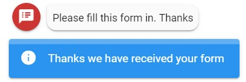

# Postback Object

The data for the form fields is always posted back to Teneo as a URL encoded JSON string. It's value is assigned to a configurable request parameter but the default parameter name is "`formData`".

To capture the `formData` in Teneo you must validate that the request parameter exists on an inbound request and if so you should URL decode it's value and then attempt to parse it as JSON.

You can use the following code to retrieve the form data in Teneo:

```groovy
def formData = engineEnvironment.getParameter("formData"); 
if (formData) { 
    formData = parseJson(UrlDecode(formData)) 
}
println(formData.someField)
```

## JSON Configuration

`"postback": {}`  [See usage here](./#component-configuration)

<table>
  <thead>
    <tr>
      <th style="text-align:left">Property</th>
      <th style="text-align:left">Required/Optional</th>
      <th style="text-align:left">Default Value</th>
      <th style="text-align:left">Type</th>
      <th style="text-align:left">Notes</th>
    </tr>
  </thead>
  <tbody>
    <tr>
      <td style="text-align:left">formDataUrlParam</td>
      <td style="text-align:left">optional</td>
      <td style="text-align:left">formData</td>
      <td style="text-align:left">String</td>
      <td style="text-align:left">The form data captured is put into a JSON object, URL encoded and added
        as a value to a request parameter with this name</td>
    </tr>
    <tr>
      <td style="text-align:left">userInput</td>
      <td style="text-align:left">optional</td>
      <td style="text-align:left"><code>&lt;empty&gt;</code>
      </td>
      <td style="text-align:left">String</td>
      <td style="text-align:left">Some text to enter into the chat after the user clicks submit. This text
        will be send back to Teneo as user input</td>
    </tr>
    <tr>
      <td style="text-align:left">confirmationAlert</td>
      <td style="text-align:left">optional</td>
      <td style="text-align:left"><code>&lt;empty&gt;</code>
      </td>
      <td style="text-align:left">String</td>
      <td style="text-align:left">
        <p>If a value is entered then the user will see and information alert in
          the chat window with the configured message. No alert is shown by default.</p>
        <p></p>
        <p></p>
      </td>
    </tr>
  </tbody>
</table>

```javascript
{
   "formDataUrlParam":"formData",
   "userInput":"Thanks, I've completed the form",
   "confirmationAlert":"Thanks we have received your form"
}
```

