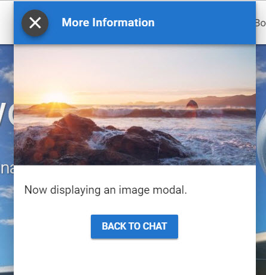

# Image

## Modal

### Screenshot



### Output Parameter

```groovy
extensions = ${ExtensionHelper.displayImage(imageUrl,channel)}
```

### JSON

```javascript
{
	"name": "displayImage",
	"parameters": {
		"image_url": "https://www.fillmurray.com/640/360"
	},
	"inline": false
}
```

## Inline

### Screenshot


### Output Parameter

```groovy
extensions = ${ExtensionHelper.displayImage(imageUrl,channel,true)}
```

### JSON

```javascript
{
	"name": "displayImage",
	"parameters": {
		"image_url": "https://www.fillmurray.com/640/360"
	},
	"inline": true
}
```

