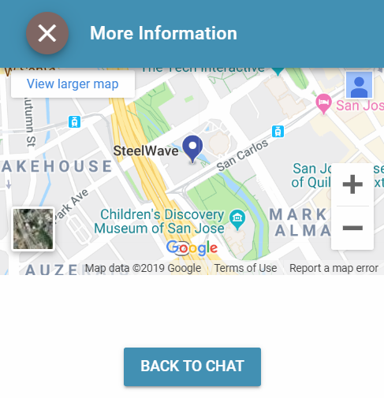
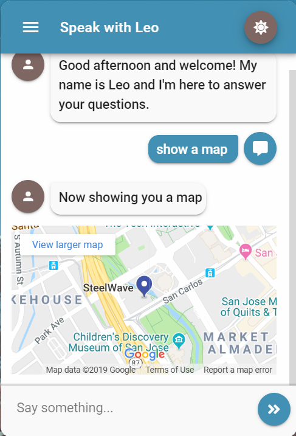

# Maps

## Modal

### Screenshot



### Output Parameter

```groovy
extensions = ${ExtensionHelper.displayMap("333 West San Carlos Street, 6th Floor, Riverpark Tower, San Jose, CA 95110", "webview")}
```

### JSON

```javascript
{
    "name": "displayMap",
    "parameters": {
        "address": "333 West San Carlos Street, 6th Floor, Riverpark Tower, San Jose, CA 95110"
    },
    "inline": false
}
```

## Inline

### Screenshot



### Output Parameter

```groovy
extensions = ${ExtensionHelper.displayMap("333 West San Carlos Street, 6th Floor, Riverpark Tower, San Jose, CA 95110", "webview", true)}
```

### JSON

```javascript
{
    "name": "displayMap",
    "parameters": {
        "address": "333 West San Carlos Street, 6th Floor, Riverpark Tower, San Jose, CA 95110"
    },
    "inline": true
}
```

