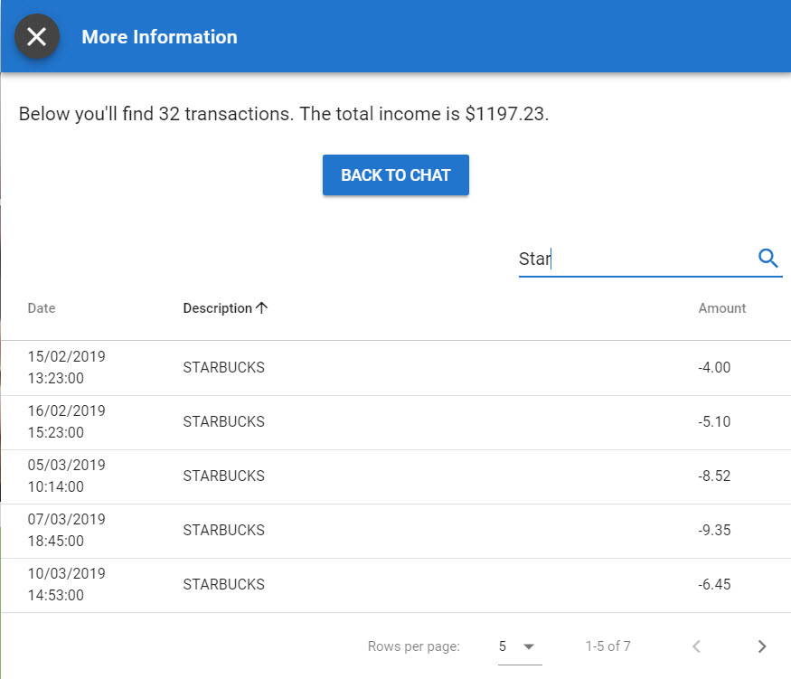

# Tables

## Screenshot



## Output Parameter

You can display a sort-able, paginated, and searchable table in a modal fly-out. 


Note that tables tend to be larger than the typical chat window width, so you might want to [position ](./#positioning)the modal center \(which is the default\) and make its [size](./#size) medium/large/x-large. 


To add a table you need to add an extensions output parameter with the following value:

```groovy
extensions = ${ExtensionHelper.displayTable("webview", "My Example Table Title", "", true, headers, rows)}
```

The `displayTable` method has this format:

```groovy
public static String displayTabledisplayTable(def channel = "webview", def title, def footer = "", def enableSearch = true, def headers, def rows, def rowsPerPage = [5, 10, 25]) {}
```

### Utility to Create Table Headers

The `headers` object passed to `ExtensionHelper.displayTable()` contains all the information for each column's functionality. For example: 

* Header's label
* Sortable
* Position \(left, center and right\) 
* Width

[ExtensionHelper](../../../installation.md#extensionhelper) has a utility function that will assist you in creating the object representing the table headers.

```groovy
public static Map createTableHeader(text, value, sortable = false, align = "center", width = "") {}
```

### Full Example

Here's a script that will build a basic table. Note you can position table headers left, right or center.

```groovy
// 3 column table [date | description | cost]
def dateHeader = ExtensionHelper.createTableHeader("Date", "date", true, "left", "20%");
def descriptionHeader = ExtensionHelper.createTableHeader("Description", "desc", false, "left");
def costHeader = ExtensionHelper.createTableHeader("Cost", "cost", true, "left", "20%");

headers = [dateHeader, descriptionHeader, costHeader]
rows = [
	[
		"date": "03/30/2018",
		"desc": "Description 1",
		"cost" : "\$100"
	],
	[
		"date": "05/22/2018",
		"desc": "Description 2",
		"cost" : "\$200"
	],
	[
		"date": "07/15/2018",
		"desc": "Description 3",
		"cost" : "\$300"
	],
]
```

#### Output Parameter

Now to display the table above you would add the following Output Parameter

```groovy
extensions = ${ExtensionHelper.displayTable("webview", "My Example Table Title", "My Footer Text", true, headers, rows)}
```

## JSON

```javascript
{
  "name"       : "displayTable",
  "parameters" : {
    "title"        : "Your Accounts",
    "enableSearch" : true,
    "headers"      : [
      {
        "text"     : "Account",
        "value"    : "account",
        "align"    : "left",
        "sortable" : true,
        "width"    : "70%"
      },
      {
        "text"     : "Balance",
        "value"    : "balance",
        "align"    : "left",
        "sortable" : true
      }
    ],
    "rows"         : [
      {
        "account" : "Current",
        "balance" : "$1271.21"
      },
      {
        "account" : "Private",
        "balance" : "$137.54"
      },
      {
        "account" : "Savings",
        "balance" : "$2376.54"
      }
    ],
    "rowsPerPage"  : [ 5, 10, 25 ]
  }
}
```

