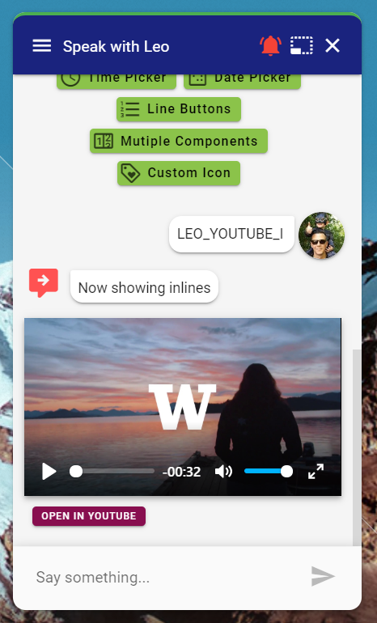

# Video

## Introduction

The video component can display **YouTube**, **Vimeo** and **mp4** videos. It also capable of showing a audio player if you link directly to a **mp3**. 

## Modal

### Screenshot


### Output Parameter

```groovy
extensions = ${ExtensionHelper.displayVideo(url,channel)}
```

### JSON

```javascript
{
	"name": "displayVideo",
	"parameters": {
		"video_url": "https://www.youtube.com/watch?v=84WIaK3bl_s"
	},
	"inline": false
}
```

## Inline

### Screenshot



### Output Parameter

```groovy
extensions = ${ExtensionHelper.displayVideo(url,channel,true)}
```

### JSON

```javascript
{
	"name": "displayVideo",
	"parameters": {
		"video_url": "https://www.youtube.com/watch?v=84WIaK3bl_s"
	},
	"inline": true
}
```

