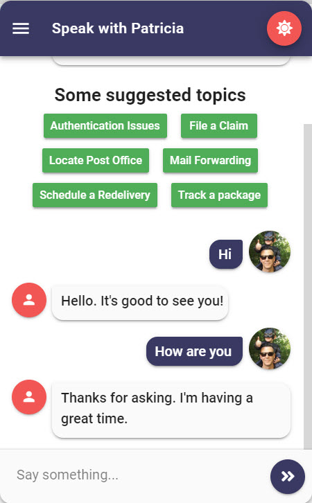
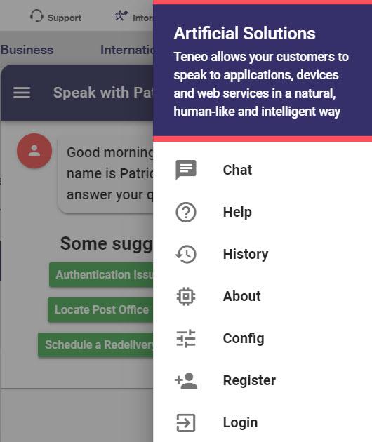
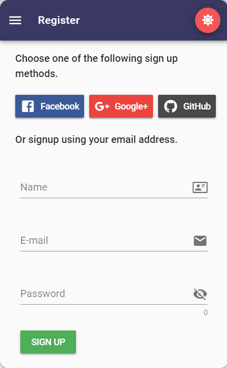
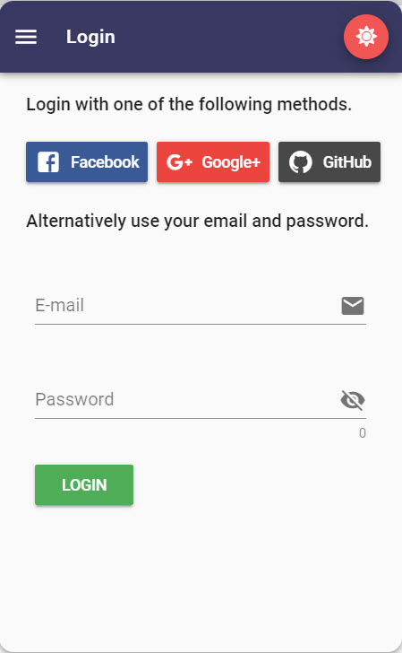

# Social Authentication

Once a user is authenticated their full name and email address will be sent to Teneo along with every request.


Longer term I would like to only send an auth token to Teneo and have Teneo validate that token and then retrieve the user information directly from Firebase. 


## Screenshots



















## Firebase and Leopard Config

You will need to setup a Firebase project and enable social authentication for the following Sign-in providers: 

* Email/Password
* Google
* Facebook
* GitHub

Define your Firebase configuration in Leopard's .env file.


```text
VUE_APP_FIREBASE_API_KEY=
VUE_APP_FIREBASE_AUTH_DOMAIN=
VUE_APP_FIREBASE_DATABASE_URL=
VUE_APP_FIREBASE_PROJECT_ID=
VUE_APP_FIREBASE_STORAGE_BUCKET=
VUE_APP_FIREBASE_MESSAGING_SENDER_ID=
```


## Capture Email and Name in Teneo


```groovy
if (engineEnvironment.getParameter("name")) { 
	Lib_sUserFirstName = engineEnvironment.getParameter("name").split()[0]
}

if (engineEnvironment.getParameter("email")) { 
	globalUserEmail = engineEnvironment.getParameter("email")
}
```


