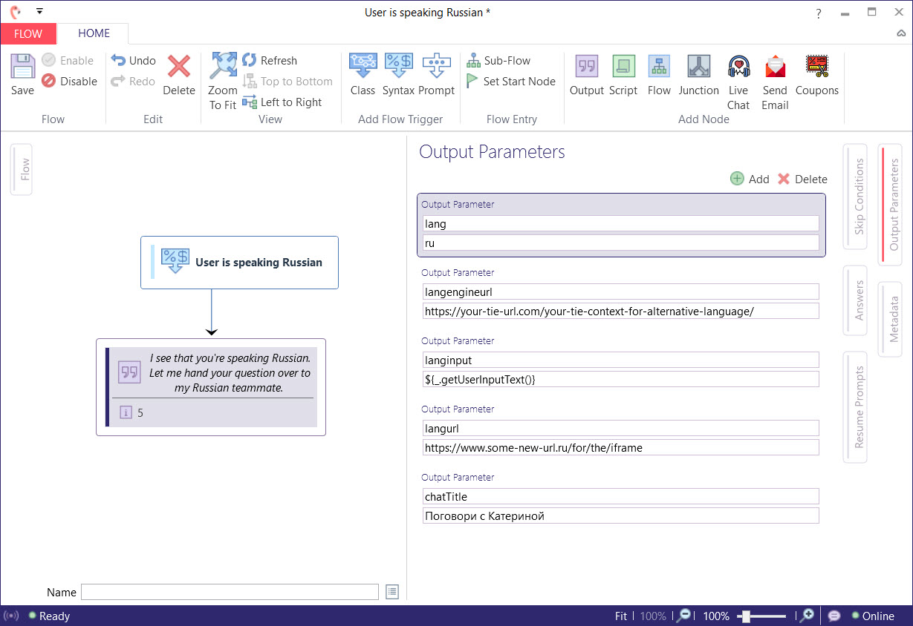

# Language Auto Switch


Although this functionality in Leopard was created to showcase the ability to switch solutions based off the spoken language of the user it could just as well be applied in alternative scenarios. 

For instance maybe you have separate Teneo Solutions that handle different domains of knowledge. If a classifier in one solution knew that the user's question related to something in another solution then a switch could be triggered.


## Output Parameters

To tell Leopard that a switch needs to occur you must define a **couple** output parameters in the `Source Solution`.

```text
langinput = User input text you want to send to the new Teneo Runtime URL
```

The language Input will usually be the captured user input that triggered a flow that looks for alternative languages spoken. 

```text
langengineurl = the new target Teneo Interaction Engine URL
```

With both of these output parameters Leopard will automatically make a request to the new TIE url and it will pass the text found in the `langinput` output parameter as the user input.  For the remainder of the user's session, Leopard will continue to communicate with the new TIE server. 

If you want the Leopard UI to show labels in the respective language then you mush specify the following output parameter.

```text
lang=en/es/de/nl/fr/ru
```

To have the Leopard UI load a different Iframe for the new language solution then specify the URL as an output parameter.

```text
langurl=https://some-new-url.es/
```

## Additional Output Parameters

You can control not just the new target iframe url and TIE url but also the Leopard Chat Title and locale for UI labels and ASR and TTS.

### Screenshot



