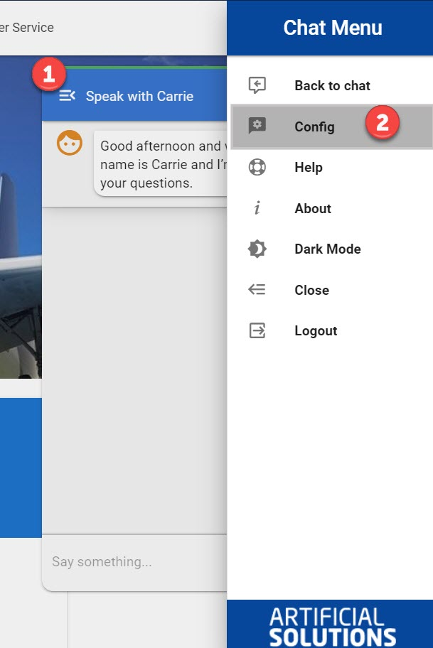

# Solution Configuration

## Initial Load

On initial load of the Leopard chat client the logic in the code will look to see if it can find a [default configuration](leopard-config-page.md#default-configuration) to load. If that configuration can't be located you can head over into the [config page](leopard-config-page.md#config-page) and create a new one.

### Default Configuration

Leopard loads the site's configured in your `.env.solution.json` file located in the root of Leopard's source code.  

You can export any full solution config from your personal Leopard Admin Area and use that as the default in production.   

Example `.env.solution.json`

```javascript
{
  "activeSolution": "241ae1c3-leopard-983c02abe2b3",
  "solutions": [
    {
      "name": "Leopard Test Solution",
      "url": "https://teneo-demos-fusion.presales.artificial-solutions.com/leopard/",
      "deepLink": "leopard",
      "iframeUrl": "https://wi.presales.artificial-solutions.com/leopard-info/",
      "sendContextParams": "all",
      "contextParams": [
        {
          "name": "channel",
          "values": [
            {
              "text": "webview",
              "active": true
            }
          ]
        }
      ],
      "animations": {
        "in": "slideInUp",
        "out": "flipOutY"
      },
      "chatTitle": "Speak with Leo",
      "responseIcon": "mdi-comment-arrow-right",
      "userIcon": "mdi-comment-quote-outline",
      "useLocalStorage": false,
      "enableLiveChat": false,
      "theme": {
        "primary": "#1A237E",
        "secondary": "#880E4F",
        "accent": "#4CAF50",
        "success": "#8BC34A",
        "info": "#E65100",
        "error": "#FF5252",
        "warning": "#FFC107",
        "dark": "#0062B1",
        "custom1": "#6A1B9A",
        "custom2": "#0062B1",
        "custom3": "#0062B1",
        "focusButton": "#C8C4C4",
        "sendButton": "#311B92",
        "textButton": "#000000"
      },
      "displayAccent": true,
      "knowledgeData": ["What's your name?", "Who created you?"],
      "float": true,
      "showChatIcons": true,
      "asrCorrections": "pizza | Peter\nthiss | that",
      "pulseButton": true,
      "playResponseBeep": true,
      "promptTriggers": {
        "enabled": false,
        "pollSeconds": "5"
      },
      "customCssButtonToolbar": "",
      "locale": "en-us-female",
      "longResponsesInModal": false,
      "useInProduction": false,
      "font": "leopard-font-medium",
      "lookAndFeel": {
        "response": {
          "iconColor": "error",
          "blockBgColor": "white",
          "blockTextColor": "dark"
        },
        "question": {
          "iconColor": "accent",
          "blockBgColor": "white",
          "blockTextColor": "dark"
        }
      },
      "id": "241ae1c3-leopard-983c02abe2b3",
      "responseDelay": 0,
      "enableAsrTtsOnOpen": false
    }
  ]
}

```

The solution called,  `Leopard Test Solution` would be loaded for all new users accessing the Leopard deployment.

## Accessing the Config Page

You can always access the config from the Leopard chat window's menu.



## Config Page

### Features

* Create new solution configurations
* Edit existing solution configurations
* Clone existing solution configurations
* Delete existing solution configurations
* Exporting
  * Export an individual solution configuration
  * Exporting all solution configurations
* Importing
  * Importing individual solution configurations
  * Importing a batch of solution configurations
* Share solutions by generating a link that other can follow to import your solution
* Test TIE endpoints for all configured solutions
* Accessing short links for the selected solution configuration
  * Mobile view deep link
  * Website view deep link
* Access the documentation


## Solution Add/Edit Screen


## Exporting

You can export the JSON configuration for individual solutions or all solutions from within the config area of Leopard. You can either choose to have the configuration exported to the file system or copied to your clipboard. 


## Importing

Within the Leopard configuration page you can import previously exported solution configurations.  Adding and merging is all automatically handled.  


