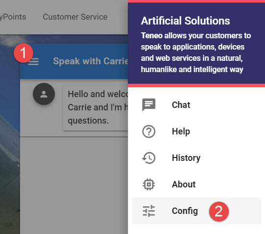
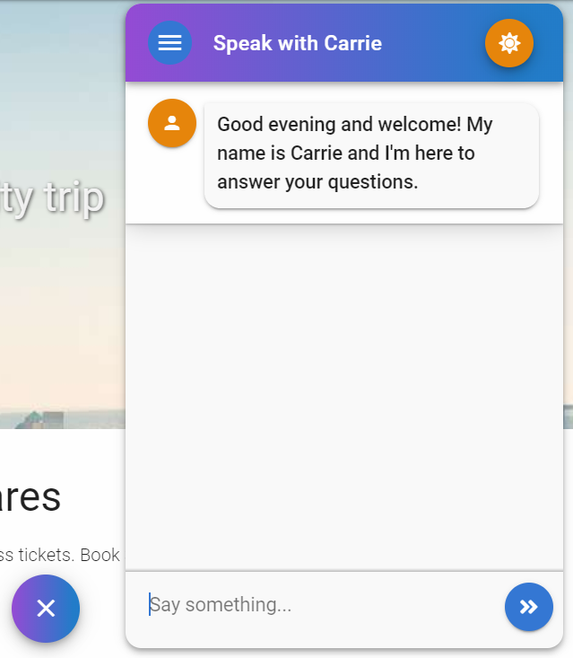
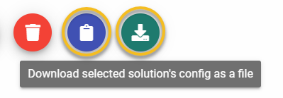
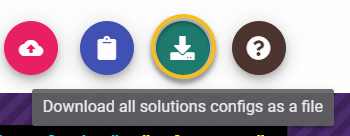
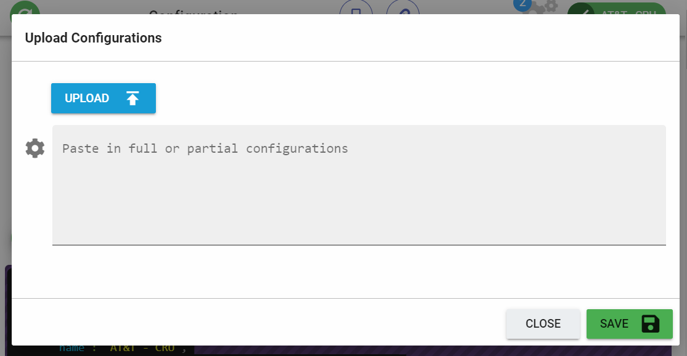

# Leopard Config Page

## Initial Load

On initial load of the Leopard chat client the logic in the code will look to see if it can find a [default configuration](leopard-config-page.md#default-configuration) to load. If that configuration can't be located you can head over into the [config page](leopard-config-page.md#config-page) and create a new one.


If you want a working Leopard interface for the majority of people on first load then you must define a default configuration. If you don't then every person will be required to manually setup their solutions. 

Each person's solution configurations are stored in their browser's local storage.  


### Default Configuration

Once Leopard is [built and deployed ](../installation.md#build)there will be a file called `/static/default.json` located in the distribution. 

You can export any full solution config from your personal Leopard configuration and use that as the default `default.json`  

Example `default.json`

```javascript
{
  "activeSolution": "My Demo Solution",
  "solutions": [
    {
      "name": "My Demo Solution",
      "url": "https://teneo-interaction-engine.com/my-solution-ctx/",
      "deepLink": "my-demo-deep-link",
      "iframeUrl": "https://www.artificial-solutions.com/",
      "sendContextParams": "all",
      "contextParams": [
        {
          "name": "channel",
          "values": [
            {
              "text": "webview",
              "active": true
            }
          ]
        }
      ],
      "float": "true",
      "locale": "en",
      "chatTitle": "Speak with Peter",
      "responseIcon": "person",
      "userIcon": "fa-comment-alt",
      "useLocalStorage": "false",
      "enableLiveChat": "true",
      "theme": {
        "primary": "#3277D5",
        "secondary": "#E78600",
        "accent": "#4CAF50",
        "error": "#FF5252",
        "info": "#2196F3",
        "success": "#4CAF50",
        "warning": "#FFC107"
      },
      "knowledgeData": [
        "Who created you?",
        "What's your name?"
      ]
    }
  ]
}
```

The solution called, `My Demo Solution` would be loaded for all new users accessing the Leopard deployment.

## Accessing the Config Page

You can always access the config from the Leopard chat window's menu.



## Config Page

### Features

* You can create new solution configurations
* You can edit existing solution configurations
* You can clone existing solution configurations
* You can delete existing solution configurations
* Exporting
  * Export an individual solution configuration
  * Exporting all solution configurations
* Importing
  * Importing individual solution configurations
  * Importing a batch of solution configurations 
* Accessing short links for the selected solution configuration

  * Mobile view deep link
  * Website view deep link

  Accessing this documentation

## Styling Chat Button and Chat Window Header

At a solution level you can define custom css that is applied to both the chat open & close button as well the chat window header.

For example this css produces the look and feel seen in the image below.

```css
background: #944ad6; background: -moz-linear-gradient(left, #944ad6 0%, #207cca 90%, #207cca 100%, #207cca 100%, #207cca 100%, #1c76d6 100%, #207cca 101%, #207cca 101%, #207cca 102%, #207cca 102%); background: -webkit-linear-gradient(left,  #944ad6 0%,#207cca 90%,#207cca 100%,#207cca 100%,#207cca 100%,#1c76d6 100%,#207cca 101%,#207cca 101%,#207cca 102%,#207cca 102%); background: linear-gradient(to right,  #944ad6 0%,#207cca 90%,#207cca 100%,#207cca 100%,#207cca 100%,#1c76d6 100%,#207cca 101%,#207cca 101%,#207cca 102%,#207cca 102%); filter: progid:DXImageTransform.Microsoft.gradient( startColorstr='#944ad6', endColorstr='#207cca',GradientType=1 );
```



## Exporting

You can export the JSON configuration for individual solutions or all solutions from within the config area of Leopard. You can either choose to have the configuration exported to the file system or copied to your clipboard. 





## Importing

Within the Leopard configuration page you can import previously exported solution configurations.  Adding and merging is all automatically handled.  



