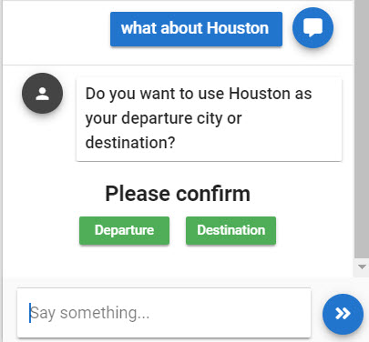
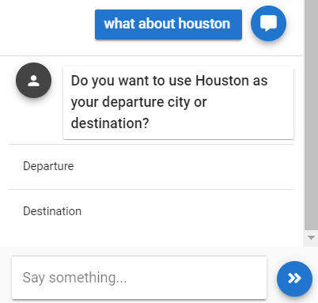

# Buttons and Lists

## Introduction

Buttons that present options to the user are typically only shown for the current turn in conversation for which they were meant to be shown. Once the user clicks a button or moves the conversation forward through text or voice, the button options in the response are removed from the UI.


Under certain scenarios you can make some buttons or options remain permanently - regardless of the turn of conversation. 


## Buttons



### Output Parameter

```groovy
extensions = ${ExtensionHelper.displayClickableList(yesNoMaybeOptions,channel)}
```

If you wanted the **buttons to persist** for any reason then specify this output parameter:

```groovy
extensions = ${ExtensionHelper.displayPermanentClickableList(yesNoMaybeOptions, channel)}
```

Where `yesNoMaybeOptions` is a groovy map stored either as a flow or global variable

```groovy
def yesNoMaybeOptions = ["title": "Please confirm",
                        "items": [
                            ["name": "Yes"],
                            ["name": "No"],
                            ["name": "Maybe"]
                        ]]
```


You can configure the map such that some custom request parameters are sent back to Teneo when a specific button is clicked. This might be useful for metadata reporting in Teneo Data or you might just want to trigger a flow based on the existence of a certain request parameter. 


```groovy
def yesNoMaybeOptions = ["title": "Please confirm",
                        "items": [
                            ["name": "Yes"],
                            ["name": "No"],
                            ["name": "Maybe", "params": "paramname=this-will-be-sent-back-in-url-when-maybe-option-clicked-optional"]
                        ]]
```

### JSON

```javascript
{
	"name": "displayCollection",
	"hasLongOptions": false,
	'permanent': false,
	"parameters": {
		"content": {
			"title": "Please confirm",
			"items": [{
					"name": "Yes"
				}, {
					"name": "No"
				}
			]
		}
	}
}
```

## Line Based Options



### Output Parameter

```groovy
extensions = ${ExtensionHelper.displayClickableList(yesNoMaybeOptions,channel, true)}
```

If you wanted the **buttons to persist** for any reason then specify this output parameter:

```groovy
extensions = ${ExtensionHelper.displayPermanentClickableList(yesNoMaybeOptions, channel, true)}
```

Where `yesNoMaybeOptions` is a groovy map stored either as a flow or global variable

```groovy
def yesNoMaybeOptions = ["title": "Please confirm",
                        "items": [
                            ["name": "Yes"],
                            ["name": "No"],
                            ["name": "Maybe"]
                        ]]
```


You can configure the map such that some custom request parameters are sent back to Teneo when a specific button is clicked. This might be useful for metadata reporting in Teneo Data or you might just want to trigger a flow based on the existence of a certain request parameter. 


```groovy
def yesNoMaybeOptions = ["title": "Please confirm",
                        "items": [
                            ["name": "Yes"],
                            ["name": "No"],
                            ["name": "Maybe", "params": "paramname=this-will-be-sent-back-in-url-when-maybe-option-clicked-optional"]
                        ]]
```

### JSON

```javascript
{
	"name": "displayCollection",
	"hasLongOptions": true,
	'permanent': false,
	"parameters": {
		"content": {
			"title": "Please confirm",
			"items": [{
					"name": "Yes"
				}, {
					"name": "No"
				}
			]
		}
	}
}
```

## Quick Button Format

If you just want to quickly produce some buttons then it might be easier to call `simpleDisplayClickableList` 

### Output Parameter

```groovy
extensions = ExtensionHelper.simpleDisplayClickableList(
        "Please Choose; Yes; No; Maybe", "webview");
```

