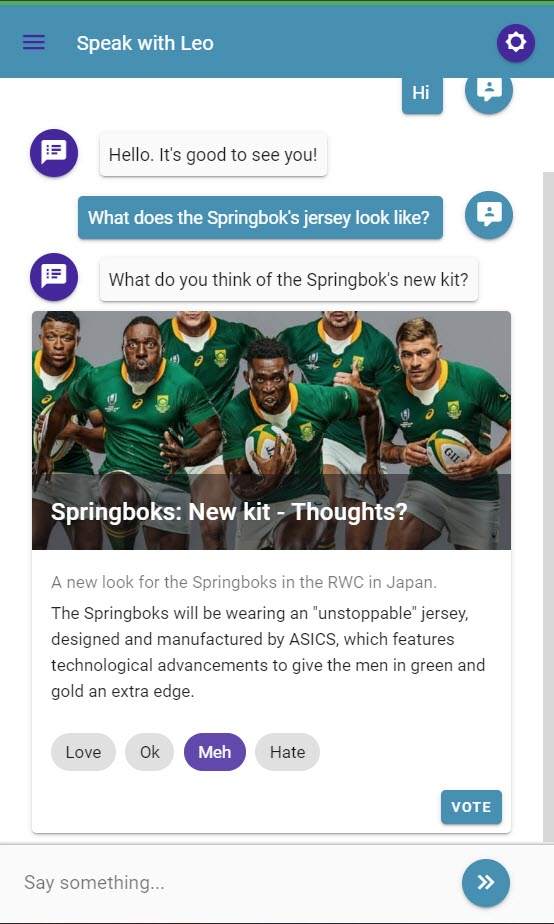

# Card

### Screenshots



### Output Parameter

```groovy
displayCard = {
    "imageUrl": "https://gcs.thesouthafrican.com/2019/04/6c0aed1b-springboks-kit-750x536.jpg",
    "title": "Springboks: New kit - Thoughts?",
    "subTitle": "A new look for the Springboks in the RWC in Japan.",
    "bodyText": "The Springboks will be wearing an \"unstoppable\" jersey, designed and manufactured by ASICS, which features technological advancements to give the men in green and gold an extra edge.",
    "chips": [
        {
            "name": "Love",
            "params": "opinion=love"
        },
        {
            "name": "Ok",
            "params": "opinion=ok"
        },
        {
            "name": "Meh",
            "params": "opinion=meh"
        },
        {
            "name": "Hate",
            "params": "opinion=hate"
        }
    ],
    "actions": [
        {
            "name": "Vote",
            "params": "vote=true"
        }
    ]
}
```

### Post back from Leopard

There will be no post backs to Leopard if there are no "action" buttons.  You can however display a card with no action buttons.  
  
If no "chips" are present but "action" buttons are then the chip's value for "name" will be sent back to Teneo as user input text. If no chips are present then the value for "name" on the action button clicked will be sent back to Teneo. In all situations the parameters for both the selected chip and clicked button will be combined and sent to Teneo.  


All main elements in the JSON config are optional. "Chips" are however dependent on the existence of "action" buttons. Both chips and action buttons **must have "params" elements**. 


