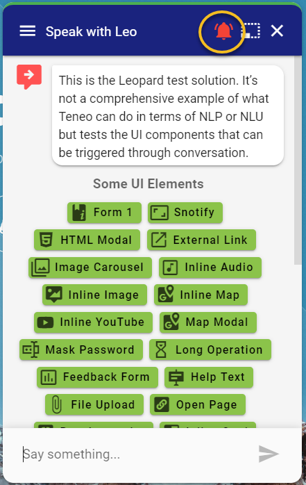

# Emergency Button



### Output Parameter

```javascript
emergency = 
{
  "icon"    : "bell-ring", // mdi icon name
  "color"   : "red", // optional
  "payload" : "&command=CMD_911" // no user input sent back but rather ctx params
}
```

`icon` is a [mdi icon](https://materialdesignicons.com/) name   
`payload` can contain any request parameters sent back to Teneo once the button is clicked

