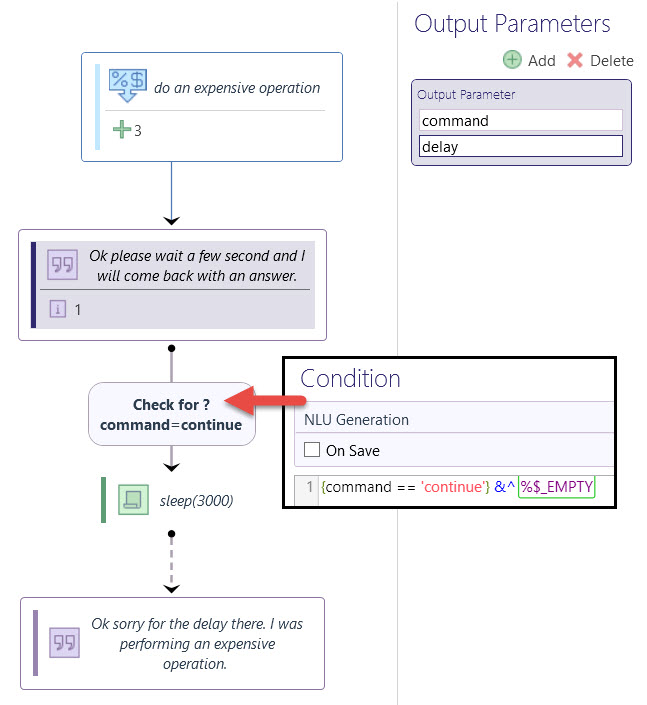

# Expensive Operations

## Instructions

Add an output parameter of `command = delay` to any output node. Leopard will then show the "thinking" graphic until it next receives a response from Teneo. When the graphic is shown Teneo automatically sends back an empty input to Teneo with a request parameter of `command=continue` .  You can then begin your expensive operation and return the response as per usual. 



Remember you can retrieve request parameters in Teneo in Pre-Processing.


```groovy
if (engineEnvironment.getParameter("command")) {
	command = engineEnvironment.getParameter("command")
} else {
	command = ""
}
```


### Screenshots


### Output Parameter

```text
command = delay
```

## 

