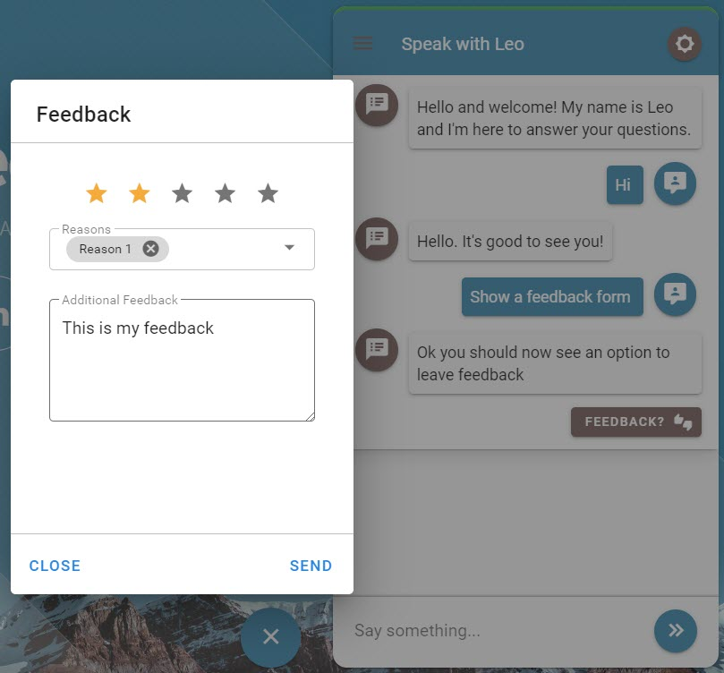
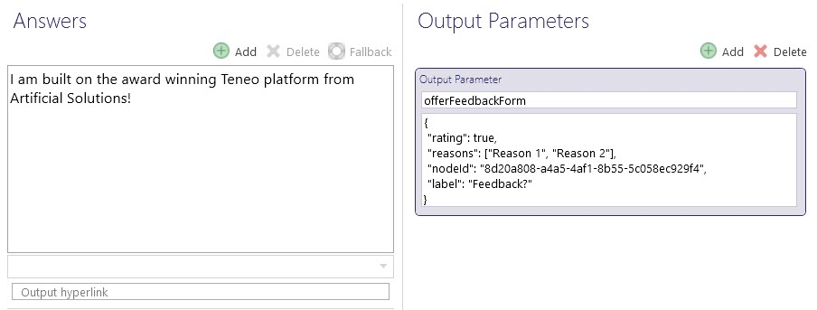

# Feedback Form

### Screenshots



### Output Parameter

```groovy
offerFeedbackForm = {
 "rating": true,
 "reasons": ["Reason 1", "Reason 2"],
 "nodeId": "8d20a808-a4a5-4af1-8b55-5c058ec929f4",
 "label": "Feedback?"
}
```



### Post Back from Leopard

When the user fills in the feedback for Leopard will send a request to your TIE with `command=feedback` and a parameter called `feedback`. The value for the feedback parameter is a URI encoded JSON string with the following format:

```javascript
{
    "rating": 3,
    "reasons": ["Reason 1", "Reason 2"],
    "comment": "This answer doesn't look correct",
    "nodeId": "8d20a808-a4a5-4af1-8b55-5c058ec929f4"
}
```


You can look for **?command=facebook** in either a pre-processing script or have a trigger in a feedback flow that then grabs the feedback and sets the feedback as flow variables that will then be persisted to Teneo Inquire. Any answer sent back from the flow will be ignored by Leopard. 


