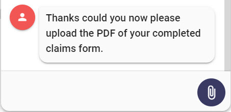
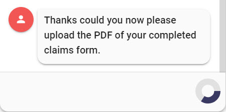
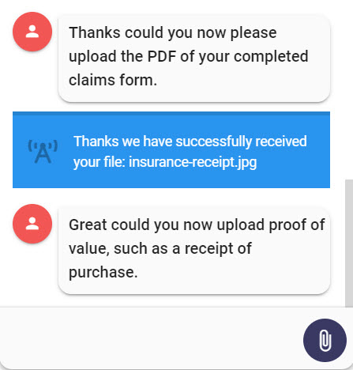

# Chat Field Types \(Email, Password, Location, Upload\)

## Email Field

The email field applies email validation against what's input. You will not be able to proceed until the validation completes. 


You could probably bypass the email validation by using an ASR input..


### Screenshots


### Output Parameter

```text
inputType = email
```

## Password Field

The password field will mask the users password as they enter it in. It will also ensure that once the password is sent to Teneo that the user's password is masked in the chat UI.

### Screenshots


### Output Parameter

```text
inputType = password
```

## Location Information

For some conversations it might be desirable to use the user's current browser location as a means of refining a back end query. To request the location information from the browser you just need to set one of the following output parameters on a node in a Teneo Flow. 

| Output Param Name | Value | Example Response Format |
| :--- | :--- | :--- |
| inputType  | locationCityStateZip | Sammamish, Washington 98075 |
| inputType  | locationZip | 98075 |
| inputType  | locationLatLong | 40.748736,-73.98486 |
| inputType  | locationJson | JSON Format seen below |



To be able to retrieve any info other than "**locationLatLong**" you will need to define a license key for [https://locationiq.com](https://locationiq.com) in **.env** called: **VUE\_APP\_LOCATION\_IQ\_KEY**


Teneo will automatically send back the requested information to Teneo. This will come in as request parameters with the same names: \(**locationCityStateZip/locationZip/locationLatLong/locationJson**\) The parameter values are URL Encoded and you should URL decode them retrieving the location information. This can be done either in a pre-processing script, a listener or a transition.

For example:

```java
import java.net.URLDecoder;
URLDecoder.decode(engineEnvironment.getParameter("locationCityStateZip"), "UTF-8")}
```

## Upload Field

The upload field will swap out the user input field with an icon that will allow the user to upload a file. You can choose to provide some additional configuration that will tell Leopard what to do with the uploaded file. 

### Output Parameter

```text
inputType = upload
```

This but itself will instruct Leopard to present an upload button and it will simulate an upload of the file. A progress spinner will be shown and when it completed the user will be notified that the file is uploaded and an empty user input will be sent to Teneo so that the conversation can continue.















### Upload Configuration

In all likelihood you will probably want the file to be upload to another server. To instruct Leopard to achieve that you will need to send along and upload configuration object to Leopard from Teneo.

#### Output Parameter

```text
extensions = ${ExtensionHelper.setUploadConfig(configMap}
```

Where `configMap` is a Groovy map:

```groovy
def configMap = [
    "postUrl": "http://url-to-post-file-to.com/some-context",
	"postFileNameParam": "file",
	"postParams": [
		"my_key": "my_value"
	],
	"teneoSuccessQuery": "&uploadResult=success",
	"teneoFailureQuery": "&uploadResult=error",
	"reqUserInputSuccess": "I have uploaded my file",
	"reqUserInputFailure": "I tried uploading but it didn't work"
]
```


You don't have to define all the keys in the map.  At the very least you need to define a `postUrl` a `postFileNameParam` and your choice the remaining keys.


#### JSON

```javascript
{
	"name": "uploadConfig",
	"parameters": {
		"postUrl": "http://url-to-post-file-to.com/some-context",
		"postFileNameParam": "file",
		"postParams": {
			"my_key": "my_value"
		},
		"teneoSuccessQuery": "&uploadResult=success",
		"teneoFailureQuery": "&uploadResult=error",
		"reqUserInputSuccess": "I have uploaded my file",
		"reqUserInputFailure": "I tried uploading but it didn't work"
	}
}
```

#### Description of the config variables

| Key | Action |
| :--- | :--- |
| postUrl | Where should the file be posted |
| postFileNameParam | When posting the file this will be the name on file file in the form data that is posted |
| postParams | An object representing additional form parameters that might need posting along with the file |
| teneoSuccessQuery | If the file is successfully posted then this query string will be sent to Teneo |
| teneoFailureQuery | If the file can't be posted then this query string will be sent to Teneo |
| reqUserInputSuccess | If the file is successfully posted then this user input will automatically be sent to Teneo |
| reqUserInputFailure | If the file can't be posted then this user input will automatically be sent to Teneo |

 

