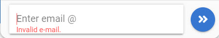
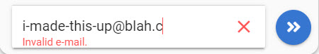
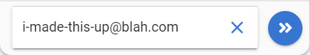
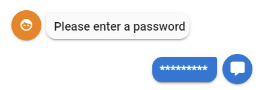
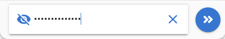
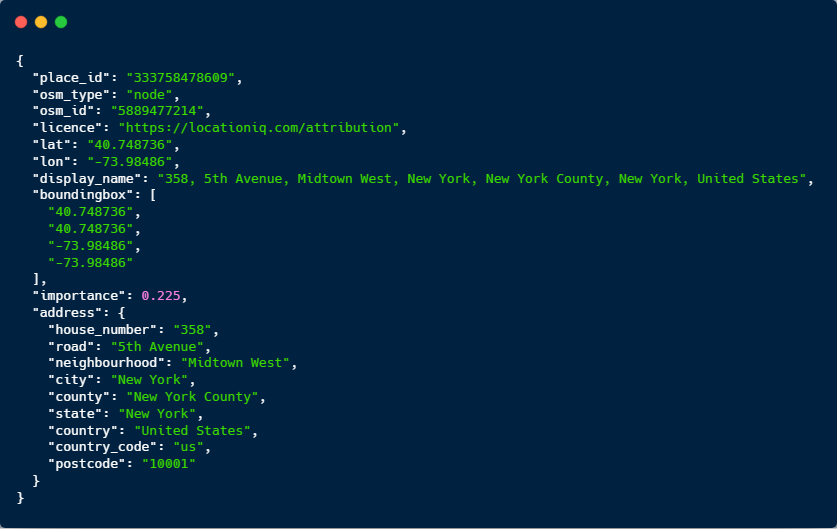

# Field Types

## Email Field

The email field applies email validation against what's input. You will not be able to proceed until the validation completes. 


You could probably bypass the email validation by using an ASR input..


### Screenshots







### Output Parameter

```text
inputType = email
```

## Password Field

The password field will mask the users password as they enter it in. It will also ensure that once the password is sent to Teneo that the user's password is masked in the chat UI.

### Screenshots






### Output Parameter

```text
inputType = password
```

## Location Information

For some conversations it might be desirable to use the user's current browser location as a means of refining a back end query. To request the location information from the browser you just need to set one of the following output parameters on a node in a Teneo Flow. 

| Output Param Name | Value | Example Response Format |
| :--- | :--- | :--- |
| inputType  | locationCityStateZip | Sammamish, Washington 98075 |
| inputType  | locationZip | 98075 |
| inputType  | locationLatLong | 40.748736,-73.98486 |
| inputType  | locationJson | JSON Format seen below |




To be able to retrieve any info other than "**locationLatLong**" you will need to define a license key for [https://locationiq.com](https://locationiq.com) in **.env** called: **VUE\_APP\_LOCATION\_IQ\_KEY**


Teneo will automatically send back the requested information to Teneo. This will come in as request parameters with the same names: \(**locationCityStateZip/locationZip/locationLatLong/locationJson**\) The parameter values are URL Encoded and you should URL decode them retrieving the location information. This can be done either in a pre-processing script, a listener or a transition.

For example:

```java
import java.net.URLDecoder;
URLDecoder.decode(engineEnvironment.getParameter("locationCityStateZip"), "UTF-8")}
```

