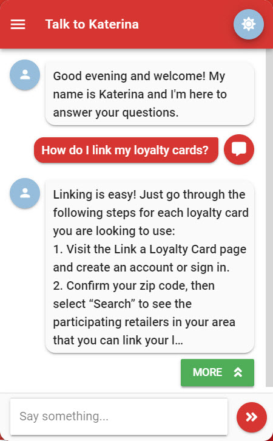
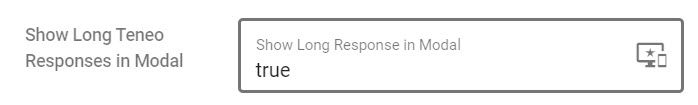

# Open Long Response in Modal

## Introduction

If the case where your Teneo Response answers are very long are imported from the bulk import tool or they are arriving from a CMS you can instruct Leopard in the solution config area to crop the long response in the main chat window and present a modal containing the longer answer text. 

This saves the effort in having to go through each answer and having to manually add the output parameters to show a modal. Current configuration is set to look for answers greater than 400 chars and if found the answer will be truncated at 300 chars and ellipsis added. A "more" button will be shown and a modal will open with the user's question as the title and the body containing the long answer text. By default this new feature is not enabled until you instruct Leopard to do so.

### Screenshots











