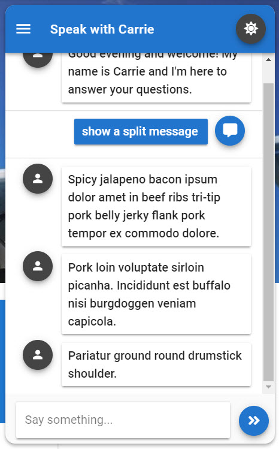

# Splitting a Response

## Screenshot

Sometimes you want to build up a response from a series of output nodes in Teneo but have control over splitting the final response into what seems like separate messages in the chat window. This can help provide context and allow for a logic separation of some messages. 

To add a split to any message just add a couple pipe symbols `||` at the location where you would like the split to occur. The pipe signs will be removed from the final output. 


Most of the modals options use the answer text to some extent in the display of the resulting modal. If you are using message splitting in the response then the first message is displayed in the modal. 


