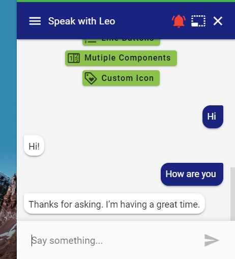
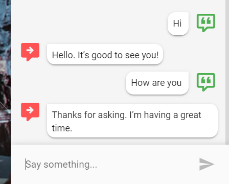
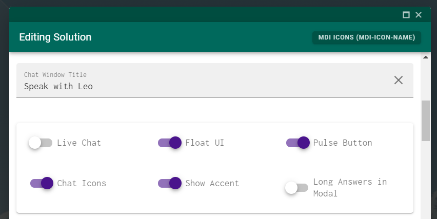

# Hiding Chat Icons

## Introduction

In some scenarios you might have a preference to hide the chat icons. This can easily be done on a solution by solution basis. 

### Screenshots















