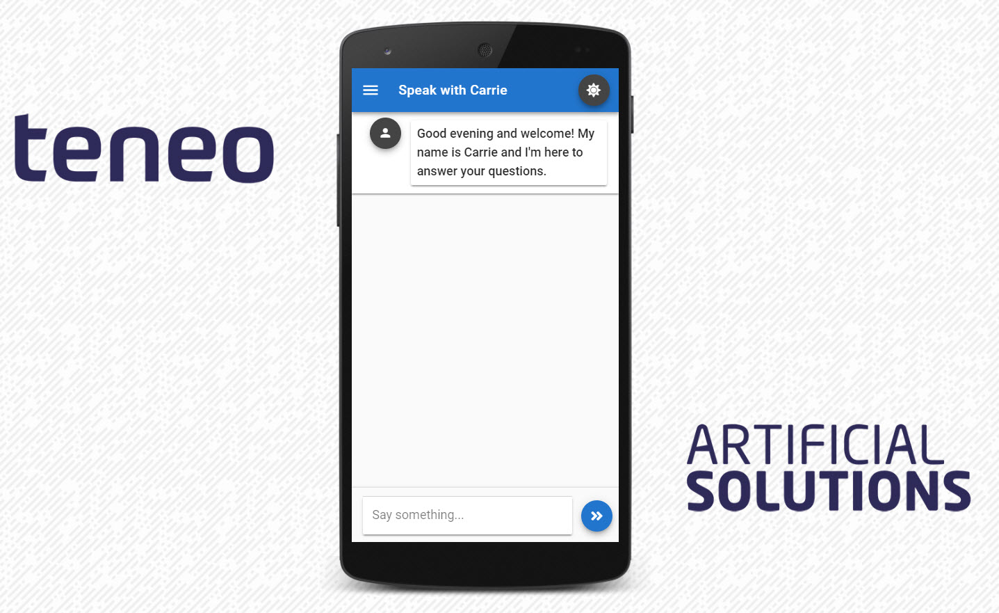

# Mobile

## Screenshots

## Mobile URL

You can always access the deep link for a configured solution by either adding `mobile.html` to the url path in Leopard or by selecting the respective solution in the Leopard configuration area and then clicking on the mobile deep link button. 

