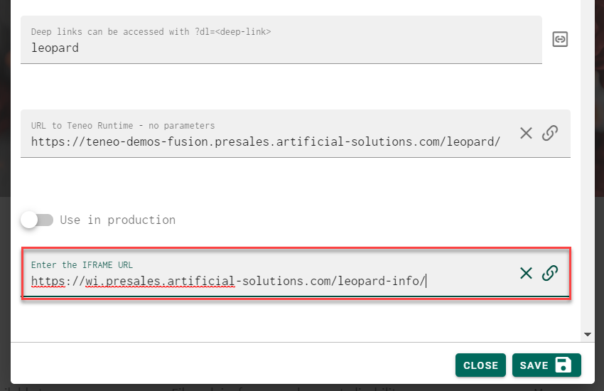

# Demo Mode - iFrames & URLs

## Main Site URL

When creating a new solution configuration in the Leopard's Admin Area you have the option of defining an IFRAME url. 


If Leopard is served over a **HTTPS** url then you will want to make certain that both the Teneo Solution URL and the IFRAME url are both available over **HTTPS** 



Some sites don't like to be Iframed. This is most likely caused by the website sending back headers to instruct your browser not to IFRAME the site.  You can work around this by installing a X-Frame buster extension in your browser. There are plenty of extensions that help with this. Here's one I use: 

* [https://chrome.google.com/webstore/detail/ignore-x-frame-headers/gleekbfjekiniecknbkamfmkohkpodhe](https://chrome.google.com/webstore/detail/ignore-x-frame-headers/gleekbfjekiniecknbkamfmkohkpodhe)


## Output Node URLs

You can use the Studio functionality on an output node to specify a URL along with the answer text. Leopard is always looking for the existence of these URLs in the response and if found will tell the iframe to load that URL. 


You can specify both absolute URLs and relative ones. Relative URLs must be relative to the first IFRAME url using in the Leopard configuration for that solution. 


Therefore is your original web page was: 

[`https://mysite.com/mysite/index.html`](https://mysite.com/mysite/index.html) ``

Then the following relative path URL on an output node: 

`./another-folder/index.html` 

Will result in a redirect to: 

[`https://mysite.com/mysite/another-folder/index.html`](https://mysite.com/mysite/another-folder/index.html)\`\`

