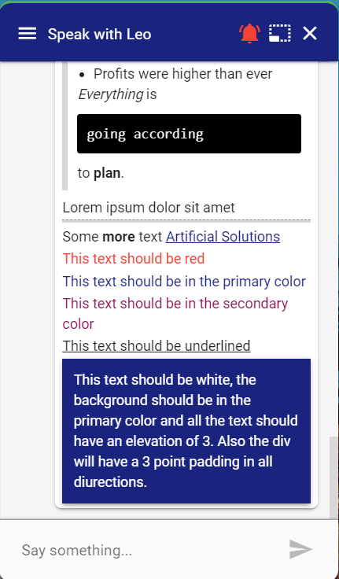

# CSS Styles

Vuetify defines a bunch of helper classes that can be used to add color, decoration, font size, margins and paddings. The classes can be found on the following pages.

| Type | Vuetify Link |
| :--- | :--- |
| Elevation | [https://vuetifyjs.com/en/styles/elevation/](https://vuetifyjs.com/en/styles/elevation/) |
| Colors | [https://vuetifyjs.com/en/styles/colors/](https://vuetifyjs.com/en/styles/colors/) |
| Border Radius | [https://vuetifyjs.com/en/styles/border-radius/](https://vuetifyjs.com/en/styles/border-radius/) |
| Spacing » Margins and Padding | [https://vuetifyjs.com/en/styles/spacing/](https://vuetifyjs.com/en/styles/spacing/) |
| Text and Typography | [https://vuetifyjs.com/en/styles/text-and-typography/\#typography](https://vuetifyjs.com/en/styles/text-and-typography/#typography) |

## Markdown and HTML example

```markup
> ### The quartely results look good!
>
> - Revenue was off the chart.
> - Profits were higher than ever
>
> *Everything* is `going according` to **plan**.

Lorem ipsum dolor sit amet
----
Some <b>more</b> text <a href="https://www.artificial-solutions.com/" target="_blank">Artificial Solutions</a>
<span class="red--text">This text should be red</span>
<span class="primary--text">This text should be in the primary color</span>
<span class="secondary--text">This text should be in the secondary color</span>
<span class="text-decoration-underline">This text should be underlined</span>
<div class="elevation-3 primary white--text pa-3">This text should be white, the background should be in the primary color and all the text should have an elevation of 3. Also the div will have a 3 point padding in all directions.</div>
```



