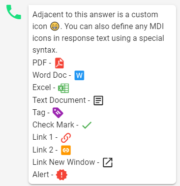
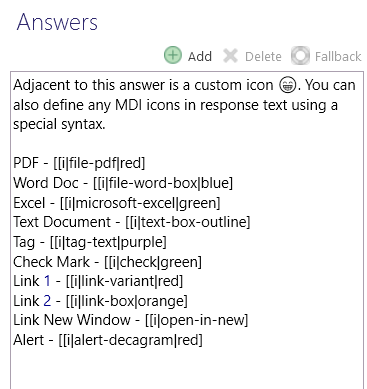

# Icons



## Markup Syntax

Leopard renders the icons in a format compatible with Vuetify. That HTML is too explicit and lengthy and not ideal for those maintaining the text responses in Teneo Studio. To simplify the addition of icons the following syntax is used. 

```text
[[i|mdi-icon-name|optional-color]
```



Here's some code that produced the response icons above.



