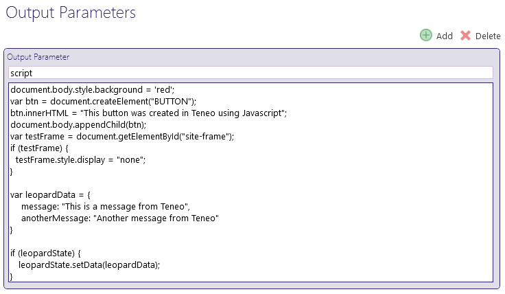

# Embedding / Production

Note that you can inject the Leopard Chat UI into a specific element on a page. This might be beneficial if you want to place it in a specific tab order. To enable this add a `<div id="leopardChatWindow"></div>` anywhere on the page. This is not required though and if absent the UI will automatically be injected at the beginning of the body.

```markup
<!DOCTYPE html>
<html lang="en">
  <head>
    <meta charset="UTF-8" />
    <meta name="viewport" content="width=device-width, initial-scale=1.0" />
    <meta http-equiv="X-UA-Compatible" content="ie=edge" />
    <title>Your Website</title>
    <script type="text/javascript">
      // [optional] only include this if you want to send info to Teneo via Leopard
      window.TENEOCTX || (TENEOCTX = {});
      TENEOCTX = {
        eventSource: "leopard-embed",
        pageTitle: document.title,
        pageUrl: window.location.href,
        pageTopic: "Help",
        message: "This was sent from the customer's web site"
      };

      // [optional] If you want to be able to react client side to data send by Teneo via Leopard
      var leopardState = {
        data: {},
        listener: function (val) {},
        setData: function (val) {
          this.data = val;
          this.listener(val);
        },
        getData: function () {
          return this.data;
        },
        registerListener: function (listener) {
          this.listener = listener;
        }
      };

      // [optional] Some external JavaScript can then listen for state changes by registering a listener
      if (leopardState) {
        leopardState.registerListener(function (dataFromLeopard) {
          alert("Leopard just sent this data to the page: " + JSON.stringify(dataFromLeopard));
        });
      }
    </script>
  </head>
  <body>
    <!-- NB: use the full url to static/embed-leopard.js below -->
    <div id="leopardChatWindow"></div>
    <script src="https://<your-leopard-host>/<leopard-ctx>/static/embed-leopard.js"></script>
  </body>
</html>

```

The keys in the `TENEOCTX` object will be passed as individual request parameters to your TIE endpoint with every request.  

You can pick up any of the parameters in a pre-processing script in Teneo Studio.


```groovy
if (engineEnvironment.getParameter("pageTitle")) {
	pageTile = engineEnvironment.getParameter("pageTitle")
}

if (engineEnvironment.getParameter("pageUrl")) {
	pageUrl = engineEnvironment.getParameter("pageUrl")
}

if (engineEnvironment.getParameter("pageTopic")) {
	pageTopic = engineEnvironment.getParameter("pageTopic")
}

if (engineEnvironment.getParameter("message")) {
	message = engineEnvironment.getParameter("message")
}
```


## Dynamically passing information

### Pass information from website to Leopard and Teneo

You can also dynamically make Leopard and Teneo aware of some page information by posting a message to the frame using JavaScript.


Only use this method when some dynamic HTML or action has happened on the page and you want Leopard to be updated.


```javascript
var teneoFrameWindow = window.frames.teneochatwidget;
if (teneoFrameWindow) {
  var newInformation = {
    message: "something interesting just happened",
    otherParam: "lorem ipsum"
  };
  teneoFrameWindow.postMessage(JSON.stringify(newInformation), "*");
}
```

### Pass information from Teneo through to the website

You can run JavaScript sent from Teneo on the website that embeds Teneo. Add an output parameter to any node in Teneo with the name "**script**" with the value containing the JavaScript you want to run.




The above code snippet shows that you can run ad hoc JavaScript against the page that is embedding Leopard. You can also populate the **`leopardState`** object if you have defined it on the target page and that data can then be subscribed to from other scripts. 


