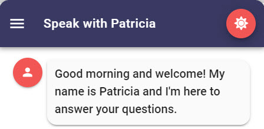

# Installation

## Git

You will need to download and install Git to clone Leopard from Github.



## Node

You will need to have Node.js installed. Version `12.13` is supported by Leopard.



## Vue CLI

You will need to install Vue CLI globally.



```groovy
npm install -g @vue/cli
```

## Code


Once you have installed **Git**, **Node.js** and **Vue CLI** you are ready to clone the Leopard repository.


### Github

The latest code is stored in Github.

[**https://github.com/jolzee/chat-teneo-vue**](https://github.com/jolzee/chat-teneo-vue)\*\*\*\*

### Clone the Repository

Navigate into the folder you wish to clone the code into. Then run the following command. 

```bash
git clone https://github.com/jolzee/chat-teneo-vue leopard
```

 Next navigate into the cloned project

```bash
cd leopard
```

### Windows Users

If you're developing on windows you will most likely have to install `node-gyp` before you attempt to run `npm install`.  You will need to compile some native node modules.  To enable this on Windows you can run this one liner.  It's **going to take a while to complete** but it only has to be run once. **Start PowerShell as Administrator and run**:

```javascript
npm install --global windows-build-tools
```

### Project setup

This command will inspect the dependencies in the project's **package.json** file and will download them locally.

```bash
npm install
```

### Compiles and hot-reloads for development

To run a local version of Leopard for testing and development run the following.

```bash
npm run serve
```

The browser should automatically open to [http://localhost:8080/](http://localhost:8080/) once compiling has finished. You can change code in the project and the Website should automatically reload. 

### Build for just modern browsers

The following command will compile and minify all the code for production. The resulting HTML, CSS and JS code in the `/dist` folder can then be deployed to any web server.

```bash
npm run build
```


This build will only support modern browser and will not support IE11


### Build for modern browsers with IE11 fallback

```bash
npm run build:modern
```


This will allow Leopard to be run in IE11 along with modern browsers.


## Leopard Environment Variables

If you would like to leverage [Live Chat](configuration/integrations/live-chat.md), [Location Detection](configuration/response-options/field-types.md#location-information), [Pusher Messaging](configuration/integrations/pusher.md) or [Social Authentication](configuration/integrations/social-authentication.md) then you will need to update your license keys in the `.env` properties file.  Know that you can define a `.env.local` file within the same directory. This file will be used for local builds. `.env.local` files are added to `.gitignore` so that your licence keys and config isn't publicly exposed.


```text
NODE_ENV=production
VUE_APP_BUILD_COMPRESS_JAVASCRIPT_ASSETS=true
VUE_APP_EMBED_KILL_SESSION_ON_CLOSE=false
VUE_APP_FIREBASE_API_KEY=XXXXXXXXXXX_XXXXXXXXXXX-XXXXXXXXXXX
VUE_APP_FIREBASE_AUTH_DOMAIN=my-project-id.firebaseapp.com
VUE_APP_FIREBASE_DATABASE_URL=https://my-project-id.firebaseio.com
VUE_APP_FIREBASE_MESSAGING_SENDER_ID=1234567890
VUE_APP_FIREBASE_PROJECT_ID=my-project-id
VUE_APP_FIREBASE_STORAGE_BUCKET=my-project-id.appspot.com
VUE_APP_GET_STATIC_DEFAULT_CONFIG=false
VUE_APP_HIDE_CONFIG_MENU=false
VUE_APP_LIVE_CHAT_AGENT_ASSIST_SERVER=
VUE_APP_LIVE_CHAT_INC_KEY=1234567
VUE_APP_LOAD_FRESH_CONFIG_FOR_NEW_SESSIONS=false
VUE_APP_LOCATION_IQ_KEY=
VUE_APP_LOG_ROCKET=
VUE_APP_LONG_PRESS_LENGTH=1000
VUE_APP_PUSHER_KEY=
VUE_APP_SENTRY_DSN=
VUE_APP_SOLUTION_CONFIG_FILE=.env.solution.json
VUE_APP_SOURCE_MAP=false
```


### Description of Some Variables

<table>
  <thead>
    <tr>
      <th style="text-align:left">Environment Variable</th>
      <th style="text-align:left">Description</th>
    </tr>
  </thead>
  <tbody>
    <tr>
      <td style="text-align:left">VUE_APP_GET_STATIC_DEFAULT_CONFIG</td>
      <td style="text-align:left">
        <p>If set to <b><code>false</code></b> then the leopard chat client will retrieve
          your solution config json from the <code>/static/default.json</code> on first
          load. From there on the configuration is stored in your browser&apos;s
          local storage. Any changes you make in the leopard config will update the
          configuration in your local storage.</p>
        <p></p>
        <p>If set to <b><code>true</code></b> then instead of making an ajax request
          to load the default solution config from the static directory the <code>default.json</code> file
          located in <code>/src/assets/default.json</code> will be loaded. This file
          is always bundled in the final build and will not result in an AJAX request.
          Note that changing the <code>/static/default.json</code> in the deployment
          folder will do nothing when this setting is turned on.</p>
      </td>
    </tr>
    <tr>
      <td style="text-align:left">VUE_APP_HIDE_CONFIG_MENU</td>
      <td style="text-align:left">If set to <b><code>false </code></b>then you are able to navigate to Leopard&apos;s
        configuration area from the Leopard&apos;s fly-out menu. This should be
        the default setting in a development environment where you might be using
        Leopard to demonstrate multiple Teneo solutions.
        <br />
        <br />If set to <b><code>true </code></b>then the menu option for the config
        are is hidden from the menu and you will not be able to navigate to the
        respective route. This is the setting you will want to have enabled in
        a production environment where you&apos;re embedding Leopard.</td>
    </tr>
    <tr>
      <td style="text-align:left">VUE_APP_LOAD_CONFIG_FOR_NEW_SESSIONS</td>
      <td style="text-align:left">
        <p>If set to <b><code>false </code></b>then the local storage version of your
          solution configurations will be used for all new sessions with Leopard.
          This is the setting you will most likely want to have disabled in a development
          environment where possibly multiple sales engineers each use the same hosted
          Leopard UI to demonstrate different Teneo solutions. It effectively allows
          each developer to have their own configurations.</p>
        <p></p>
        <p>If set to <b><code>true </code></b>then the user&apos;s local storage is
          cleared for every new session and the <code>default.json</code> is loaded
          fresh. In a production environment you will probably want to enable this
          setting so that if you deploy a change to the solution config (color theme,
          name of the chat window, TIE endpoint url, etc.) then that change will
          appear automatically when Leopard is next opened by a user.</p>
      </td>
    </tr>
    <tr>
      <td style="text-align:left">VUE_APP_SENTRY_DSN</td>
      <td style="text-align:left">If you wanted to send core Vue errors and exceptions in a production build
        to Sentry <a href="https://sentry.io/">https://sentry.io/</a> then add your
        account&apos;s DSN.</td>
    </tr>
  </tbody>
</table>## Studio

### Capture the Channel

Leopard sends `channel=webview` to Teneo along with every request. You will want to define a global variable in Teneo and populate it based off the value of this request parameter.

```groovy
if (engineEnvironment.getParameter("channel")) { 
    channel = engineEnvironment.getParameter("channel") 
}
```

### Capture the Login command

Disable the following flow from the TDR's - `The user continues conversation after Timeout`  This flow is located in `Dialogue » Non-conversational » Timeout`

Capture the `command` request parameter. Leopard sends a `?command=login` whenever the chat window is opened. You will want to trigger the greeting message when this request parameter is present.


```groovy
if (engineEnvironment.getParameter("command")) {
	command = engineEnvironment.getParameter("command")
} else {
	command = ""
}
```


In your greeting flow you will want to add a syntax trigger with the following condition


```groovy
{command == "login"}
```


### Capture the User's Time Zone

Leopard automatically sends the user's time zone as a request parameter  \(`timeZone`\) to Teneo. This is useful in that you might want to properly greet the user based on the time of day. 

To capture the time zone in Teneo add this script to Pre-processing.

```groovy
if (engineEnvironment.getParameter("timeZone")){
	Lib_sUserTimeZone = engineEnvironment.getParameter("timeZone")
}
```

Alter the `On top` script in the default Teneo TDR `Greeting` flow to the following. The user then will be correctly greeted based off the time of day.

```groovy
TimeZone timeZone = TimeZone.getTimeZone(Lib_sUserTimeZone);
iHour = Integer.parseInt(String.format('%tH', new GregorianCalendar(timeZone)));
```



## ExtensionHelper

### Explanation

ExtensionHelper is a Groovy Class that needs to be added to your Teneo solution. You can either add it to Solution Loaded or as a .groovy file into Resources

The purpose of ExtensionHelpder is to provide some helpful methods that can be called from output parameters in your flow nodes within Teneo. The methods will allow your solution to produce a JSON response that can be correctly interpreted by the Leopard UI. 

Some methods in ExtensionHelper do accept a channel as a method option. The available channels are:

* **webview**
  * Used by the web based Leopard UI. Make sure that your solution configurations in Leopard send a `channel=webview` either at login or with every request. All new solutions have this added automatically. Just know not to delete it. 
  * Make sure you are storing the channel as a global variable in your Teneo Solution. A `Pre-processing script` can extract it from the in coming request.
    * `if (engineEnvironment.getParameter("channel")) { channel = engineEnvironment.getParameter("channel") }`
* **facebook**
  * Creates the JSON that FB messenger expects for certain UI components
* **slack**
  * Creates the JSON that Slack expects for certain UI components


The Facebook and Slack have not been updated in a while and might fall behind some of the functionality for the webview.


### Download

You can always get the latest version of ExtensionHelper here:  

[**https://github.com/jolzee/chat-teneo-vue/blob/master/src/teneo-assets/ExtensionHelper.groovy**](https://raw.githubusercontent.com/jolzee/chat-teneo-vue/master/src/teneo-assets/ExtensionHelper.groovy)\*\*\*\*

### Installation

Add the ExtensionHelper as a Class within your Teneo Solution Loaded scripts or as a `.groovy` file in your solution's resources   `/script_lib` ****. 

### Usage

To use some of the methods in ExtensionHelper you will need to add an **output parameter** called `extensions` to the output where you want to show an extended view. The value would be one of the methods in ExtensionHelper. 

For example to show an image modal in the Leopard UI you would have a value of:

```groovy
${ExtensionHelper.displayImage(imageUrl,channel)}
```

All the different modals are listed in the documentation.





