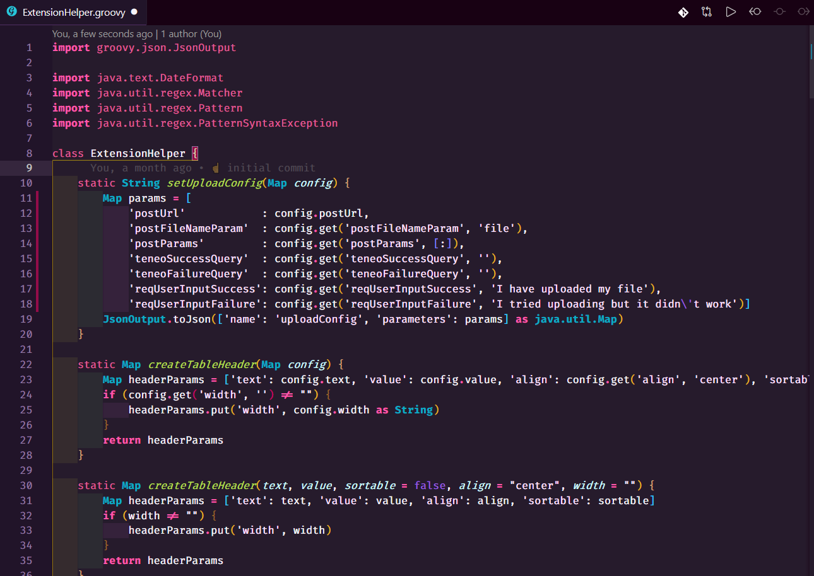

# Extension Helper

### Explanation

ExtensionHelper is a Groovy Class that needs to be added to your Teneo solution. You can either add it to Solution Loaded or as a .groovy file into Resources

The purpose of ExtensionHelpder is to provide some helpful methods that can be called from output parameters in your flow nodes within Teneo. The methods will allow your solution to produce a JSON response that can be correctly interpreted by the Leopard UI. 

Some methods in ExtensionHelper do accept a channel as a method option. The available channels are:

* **webview**
  * Used by the web based Leopard UI. Make sure that your solution configurations in Leopard send a `channel=webview` either at login or with every request. All new solutions have this added automatically. Just know not to delete it. 
  * Make sure you are storing the channel as a global variable in your Teneo Solution. A `Pre-processing script` can extract it from the in coming request.
    * `if (engineEnvironment.getParameter("channel")) { channel = engineEnvironment.getParameter("channel") }`
* **facebook**
  * Creates the JSON that FB messenger expects for certain UI components
* **slack**
  * Creates the JSON that Slack expects for certain UI components


The Facebook and Slack have not been updated in a while and might fall behind some of the functionality for the webview.


### Download

You can always get the latest version of ExtensionHelper here:  

> [https://github.com/jolzee/leopard-chat-ui-teneo/blob/master/src/teneo-assets/ExtensionHelper.groovy](https://github.com/jolzee/leopard-chat-ui-teneo/blob/master/src/teneo-assets/ExtensionHelper.groovy)



### Installation

Add the ExtensionHelper as a Class within your Teneo Solution Loaded scripts or as a `.groovy` file in your solution's resources   `/script_lib` ****. 

### Usage

To use some of the methods in ExtensionHelper you will need to add an **output parameter** called `extensions` to the output where you want to show an extended view. The value would be one of the methods in ExtensionHelper. 

For example to show an image modal in the Leopard UI you would have a value of:

```groovy
${ExtensionHelper.displayImage(imageUrl,channel)}
```

All the different modals are listed in the documentation.

