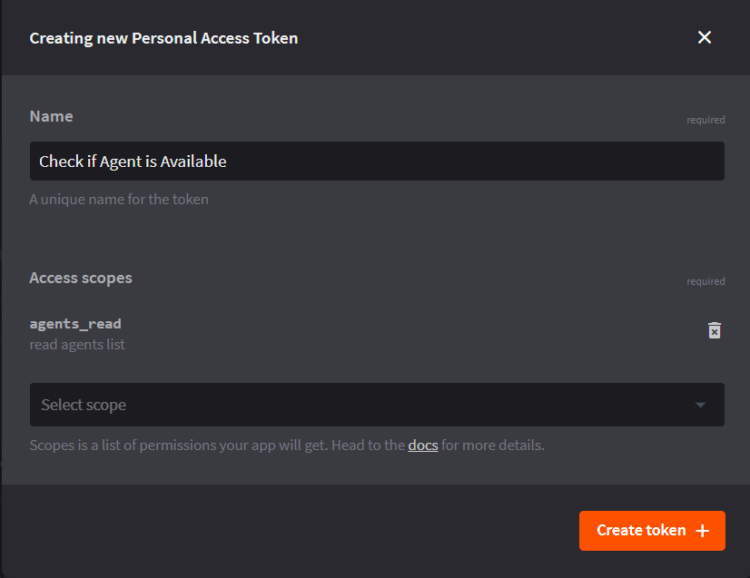

# Live Chat

## Screenshots


## Setup and Configuration

### LiveChat Account Setup

You will need to have an account at LiveChat.inc



### LiveChat Key for Leopard

You will then need to configure Leopard with your LiveChat key that points at your account. This key can be found on `/settings/chat-link` . It's a numerical number. 



Leopard's [build variables](../installation/build-variables.md) control access to the integration with LiveChat. 


```javascript
const config = {
  ...,
  /**
   * https://www.livechat.com/ integration - live chat handover
   */
  liveChatInc: {
    agentAssist: {
      /**
       * Server URL for creating agent assist canned responses -
       * https://github.com/jolzee/agent-assist-livechat-server-leopard
       */
      serverUrl: ""
    },
    key: "" // livechat.com license key
  },
  ...
};

module.exports = config;

```

### LiveChat API Key

You will also need to acquire the LiveChat Personal Access Token \(PAT\) so that an Integration in Teneo can be created. This integration will be responsible for checking to see if there is a live agent currently available before initiating a handover.

Login to LiveChat's web interface and head over to the LiveChat Deverloper Console - [https://developers.livechat.com/console/tools/personal-access-tokens](https://developers.livechat.com/console/tools/personal-access-tokens) . Create a new token. 

You can control you authorization scopes. At the very least you will need **agents\_read.**



## Studio

### Integration

When a user explicitly asks to speak to a human or some other handover rule has been triggered you will want to first check to see if there's a live agent available. This can be done using a custom integration in Teneo Studio.  **You will need to update the entity id and pat in the integration script.**


```groovy
def addr = "https://api.livechatinc.com/agents"
def authString = "entity-id:personal-access-token".getBytes().encodeBase64().toString()

def result = new groovy.json.JsonSlurper().parseText(addr.toURL().getText(connectTimeout: 2000, readTimeout: 3000,requestProperties: ['X-API-VERSION': '2','Authorization':'Basic ' + authString]));
def availableAgents = result.findAll { it.status == "accepting chats" }

agentAvailable = false
if (availableAgents.size() > 0) {
    agentAvailable = true
}
```

### Trigger Handover

The handover in Teneo is triggered by adding an output parameter to any output node.

```groovy
liveChat = ${dialogTranscript}
```

### Building the Dialog Transcript

Create a global variable called `dialogTranscript` 

#### Pre-processing Script

```groovy
if (_.userInputText) {
	dialogTranscript += "Visitor: " + _.userInputText + "\n";
}
```

#### Post-processing Script

```groovy
if (_.getOutputText()) {
	dialogTranscript += "Bot: " + _.getOutputText() + "\n";
}
```

### Example Flow


### Setting User Info

If you want the LiveChat human agent to know who they're about to talk to then you can send some additional JSON back in an output parameter.

```groovy
userInfo =   {
  "name": "John Doe",
  "email": "john.doe@example.com",
  "sessionFields": {
	 "custom_property": "BasketValue=10usd",
	 "any_key_is_ok": "sample custom field"
  }
}
```


 

