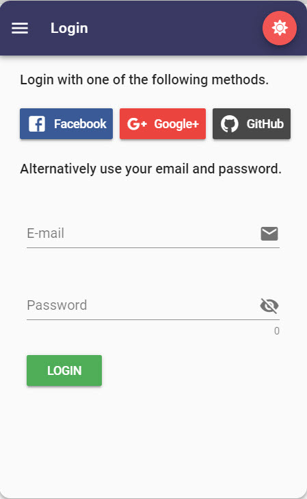

# Social Authentication

Once a user is authenticated their full name and email address will be sent to Teneo along with every request.


Longer term I would like to only send an auth token to Teneo and have Teneo validate that token and then retrieve the user information directly from Firebase. 


## Screenshots



















## Firebase and Leopard Config

You will need to setup a Firebase project and enable social authentication for the following Sign-in providers: 

* Email/Password
* Google
* Facebook
* GitHub

Define your Firebase configuration in [Leopard's Build Variables](../installation/build-variables.md).


```javascript
const config = {
  ...,
  /**
   * Social Authentication is provided through https://firebase.google.com/
   * Empty values signals no authentication
   */
  socialAuthentication: {
    firebase: {
      apiKey: "",
      authDomain: "",
      databaseUrl: "", // Firebase Realtime Database
      messagingSenderId: "",
      microsoft: {
        domainHint: "", // my-domain.com
        tenant: "" // Azure AD Tenant ID
      },
      projectId: "", // firebase project id
      providers: ["microsoft", "facebook", "google", "github"], // login and register will only show buttons for these providers
      storageBucket: ""
    }
  },
  ...
};

module.exports = config;

```


## Capture Email and Name in Teneo


```groovy
if (engineEnvironment.getParameter("name")) { 
	Lib_sUserFirstName = engineEnvironment.getParameter("name").split()[0]
}

if (engineEnvironment.getParameter("email")) { 
	globalUserEmail = engineEnvironment.getParameter("email")
}
```


