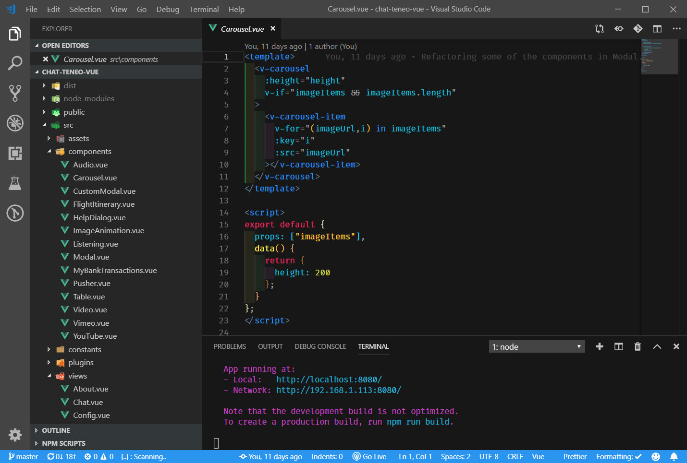
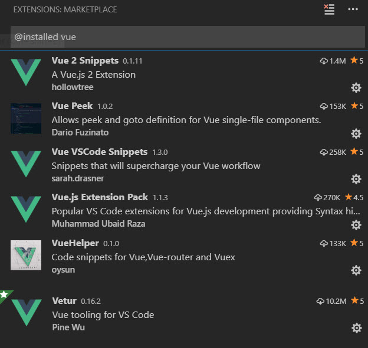
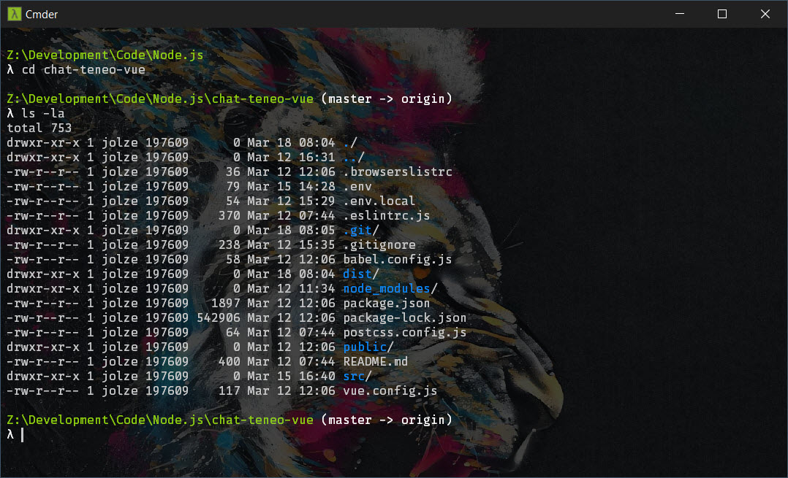

# Tools

## Node.js

You must install Node.js



## Git

You must install Git.



## Vue.js devtools

Vue has a great panel that integrates into the Browser Developer Tools, which lets you inspect your application and interact with it, to ease debugging and understanding





## Visual Studio Code

VS Code is an excellent tool that will allow you to easily work with JavaScript and Node.js apps. It comes with a wealth of useful extensions that are Node.js and Vue.js specific.








### Extensions

There are plenty of extension you can install in VS Code. Here's a list of some Vue specific extensions that I have installed:



Here's a full list of my extensions. If you wanted you should be able to copy and paste this into the command line after installing VS Code and my extensions will be installed into your VS Code. Totally optional.

```bash
code --install-extension 2gua.rainbow-brackets
code --install-extension abusaidm.html-snippets
code --install-extension alexdima.copy-relative-path
code --install-extension andrejunges.Handlebars
code --install-extension be5invis.vscode-custom-css
code --install-extension christian-kohler.npm-intellisense
code --install-extension christian-kohler.path-intellisense
code --install-extension cmstead.jsrefactor
code --install-extension CoenraadS.bracket-pair-colorizer
code --install-extension dai-shi.vscode-es-beautifier
code --install-extension dariofuzinato.vue-peek
code --install-extension daylerees.rainglow
code --install-extension dbaeumer.vscode-eslint
code --install-extension eamodio.gitlens
code --install-extension ecmel.vscode-html-css
code --install-extension eg2.tslint
code --install-extension eg2.vscode-npm-script
code --install-extension emilast.LogFileHighlighter
code --install-extension emmanuelbeziat.vscode-great-icons
code --install-extension ericadamski.carbon-now-sh
code --install-extension esbenp.prettier-vscode
code --install-extension formulahendry.auto-close-tag
code --install-extension formulahendry.auto-rename-tag
code --install-extension GrapeCity.gc-excelviewer
code --install-extension hollowtree.vue-snippets
code --install-extension ionutvmi.path-autocomplete
code --install-extension leizongmin.node-module-intellisense
code --install-extension liviuschera.noctis
code --install-extension maty.vscode-mocha-sidebar
code --install-extension mechatroner.rainbow-csv
code --install-extension ms-python.python
code --install-extension msjsdiag.debugger-for-chrome
code --install-extension mubaidr.vuejs-extension-pack
code --install-extension octref.vetur
code --install-extension oderwat.indent-rainbow
code --install-extension oysun.vuehelper
code --install-extension PKief.material-icon-theme
code --install-extension redhat.java
code --install-extension ritwickdey.LiveServer
code --install-extension sdras.vue-vscode-snippets
code --install-extension Shan.code-settings-sync
code --install-extension shinnn.stylelint
code --install-extension SirTori.indenticator
code --install-extension spoonscen.es6-mocha-snippets
code --install-extension steoates.autoimport
code --install-extension tombonnike.vscode-status-bar-format-toggle
code --install-extension Tyriar.sort-lines
code --install-extension vangware.dark-plus-material
code --install-extension vscode-icons-team.vscode-icons
code --install-extension vsmobile.cordova-tools
code --install-extension WallabyJs.quokka-vscode
code --install-extension wayou.vscode-todo-highlight
code --install-extension wesbos.theme-cobalt2
code --install-extension xabikos.JavaScriptSnippets
code --install-extension zengxingxin.sort-js-object-keys
```

## Cmder

Cmder is a Console Emulator for windows.  





## Vuetify

Vuetify is the component UI library used in Leopard. If you wanted to add some new custom components or teak existing ones then Vuetify will have all the documentation needed.






